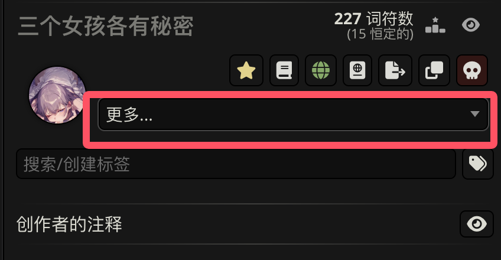
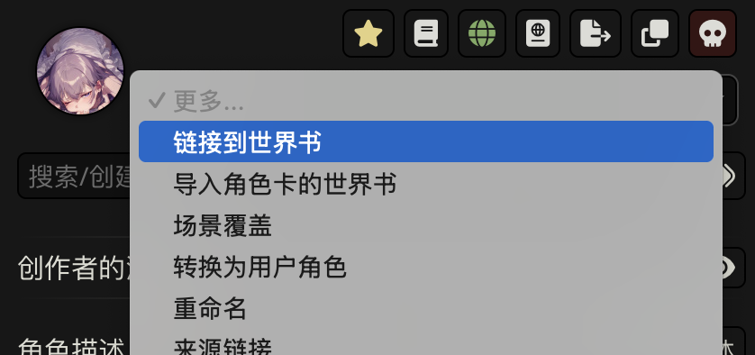
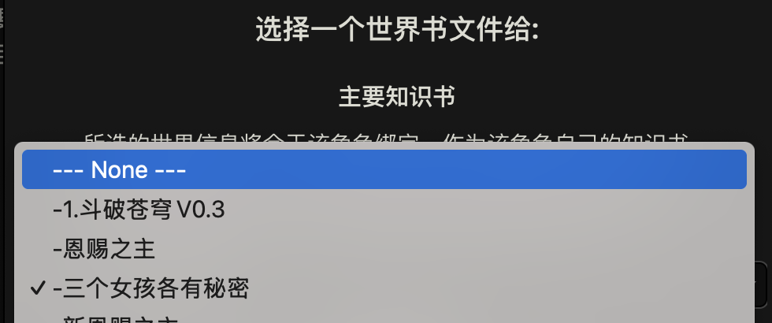

************************************************************************************************************************
正确导出新角色卡的方法
************************************************************************************************************************

更新世界书后角色卡经常不能同步上, 也就是说, 导出的角色卡依旧保存的是更新前的世界书.

为了保证导出的角色卡绑定最新的世界书, 可以解绑世界书让它绑定 ``--- None ---``, 然后再重新绑定世界书.

