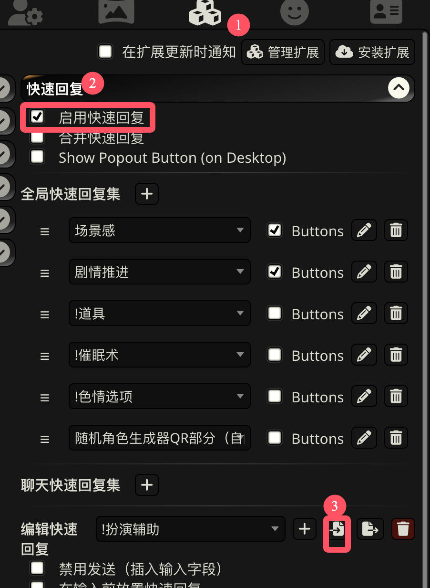
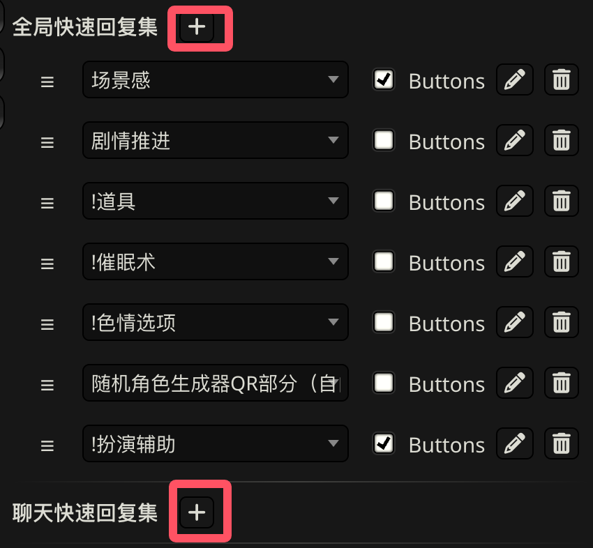
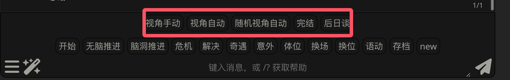
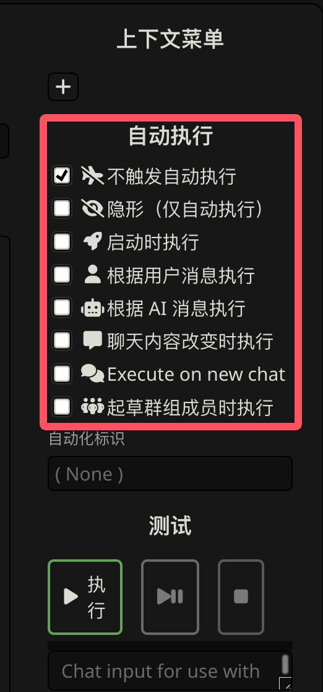

************************************************************************************************************************
导入快速回复
************************************************************************************************************************

角色卡并不自带快速回复, 对于有快速回复的卡, 你需要额外下载作者提供的快速回复文件. 如果下载下来是压缩包, 那么你还需要解压 (百度怎么解压谢谢喵).

下载好后, 我们需要导入并启用快速回复.

========================================================================================================================
导入
========================================================================================================================

首先按图导入快速回复:

========================================================================================================================
添加
========================================================================================================================

在导入完成后, 我们需要将它添加到快速回复集中.

全局快速回复集
  在所有角色卡的所有聊天中生效

聊天快速回复集
  只在当前聊天中生效. 即使同一张角色卡新建了聊天, 也是使用独立的聊天快速回复集.

.. danger::

  在某些版本下, 如果快速回复集中已经有 *选择快速回复时排列于第一位* 的快速回复, 添加快速回复会失败. 你需要先将该快速回复换成别的快速回复, 等添加后再把它改回去.

  如下图所示. 如果快速回复集中已经有 "!扮演辅助", 在一些版本下不能直接成功添加别的快速回复.

  .. figure:: 添加快速回复失败.png

========================================================================================================================
启用或禁用按钮
========================================================================================================================

在快速回复集中有一个选项 :menuselection:`buttons`, **它并不是启用/禁用快速回复**.

.. figure:: buttons.png

:menuselection:`buttons` 的意思仅仅是, 这个快速回复是否要在键入消息的地方显示按钮, 通过按钮你可以手动使用一些快速回复功能.

但是某些快速回复将部分功能设置为自动执行, 则即使关闭了 :menuselection:`buttons`, 它们依旧会自动执行. 例如, 这是快速回复的编辑界面:

