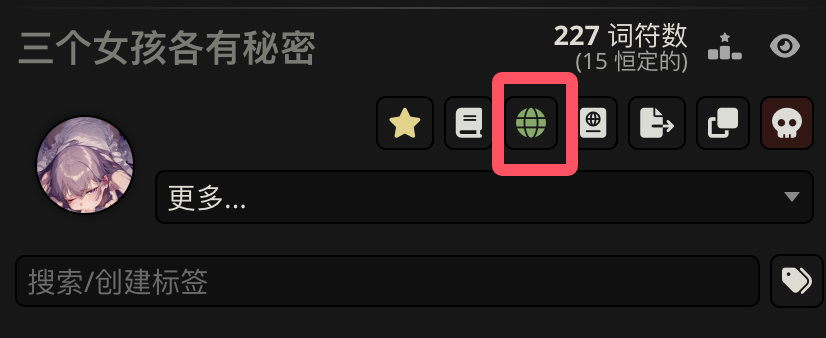
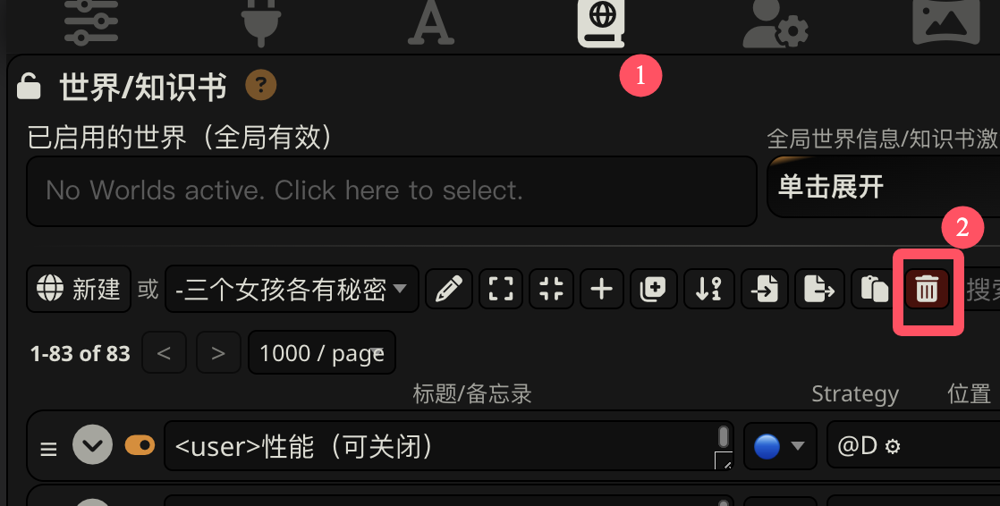
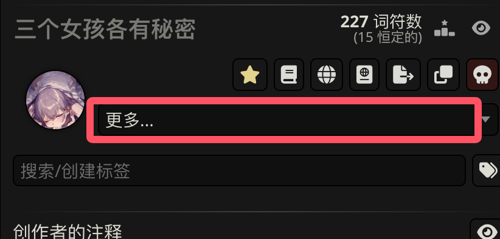
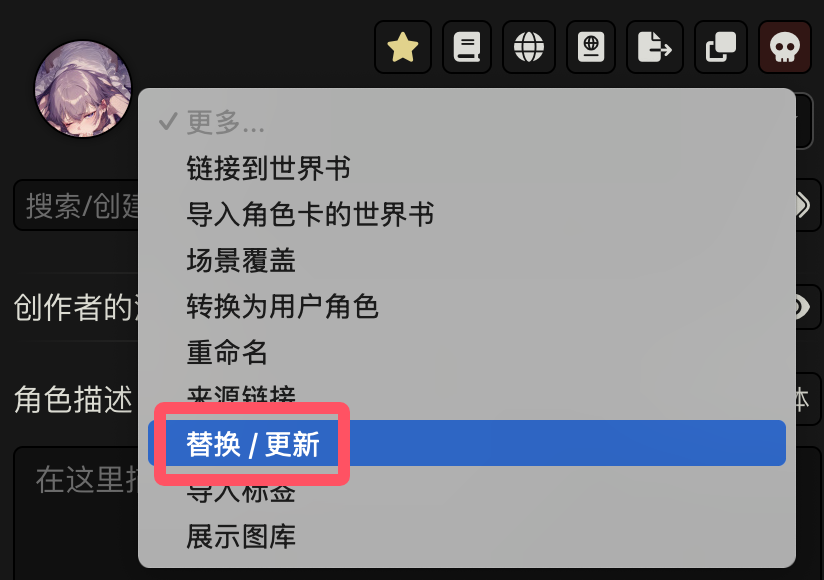
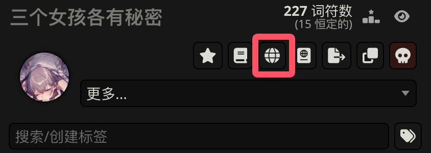
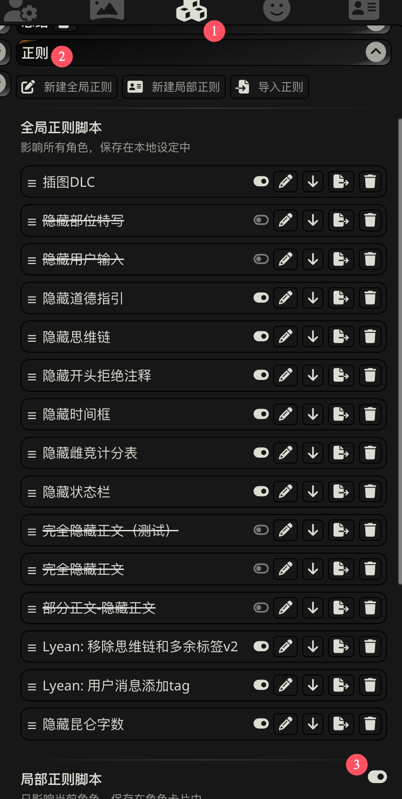

************************************************************************************************************************
正确导入新角色卡的方法
************************************************************************************************************************

角色卡往往有世界书, 而直接导入角色卡并不能替换世界书. 要更新角色卡, 应该按以下步骤.

========================================================================================================================
删除世界书
========================================================================================================================

点击角色卡界面的绿色 :menuselection:`地球图标`, 从而跳转到世界书, 删除它.

删除之后, 地球图标会变成白色.

.. figure:: 删除世界书-删除后的地球图标.png

========================================================================================================================
更新角色卡
========================================================================================================================

点击 :menuselection:`更多 --> 替换/更新`, 选择下载的新版角色卡.

========================================================================================================================
导入新的世界书
========================================================================================================================

再点击由于没导入世界书而呈白色的 :menuselection:`地球图标`, 从而导入世界书.

========================================================================================================================
确认局部正则
========================================================================================================================

一般来说, 更新角色卡时会自动更新局部正则, 但可能没有被启用. 建议确认一下它有没有被正常启用.

========================================================================================================================
导入并启用快速回复
========================================================================================================================

:doc:`/common_issue/import_quick_reply/index`
