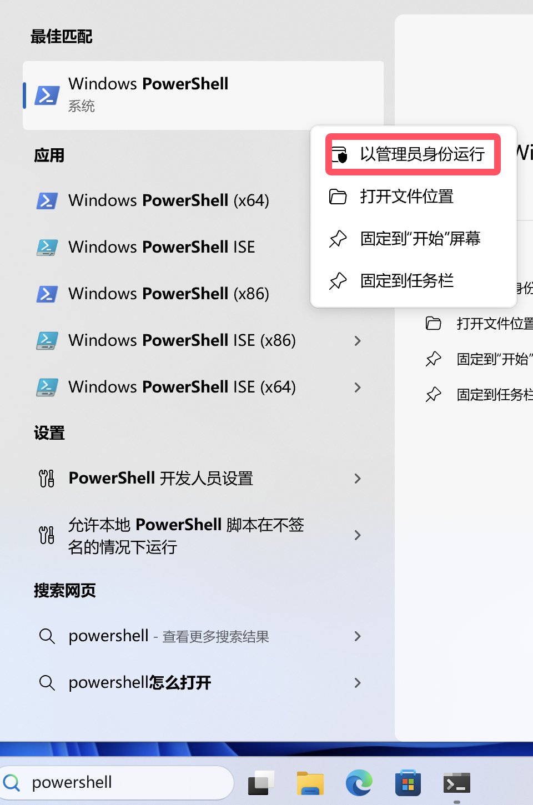
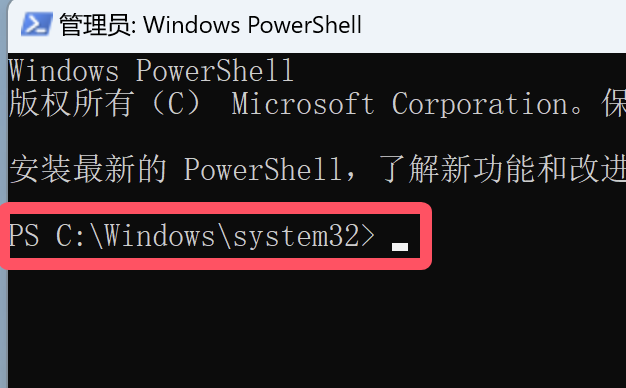
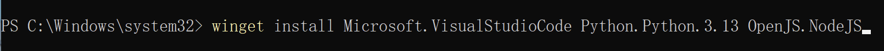
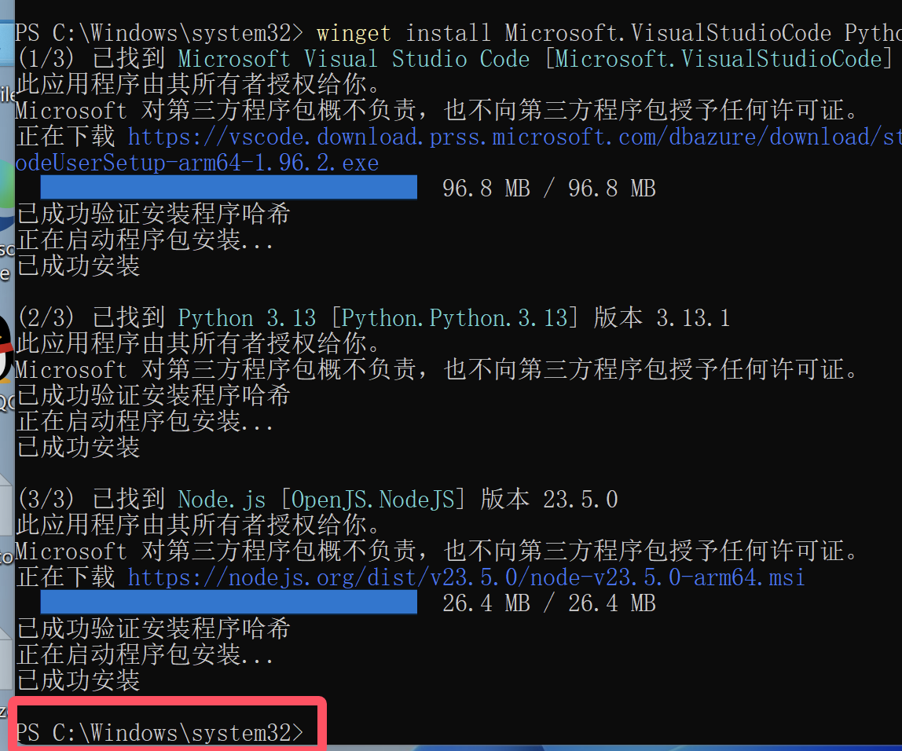
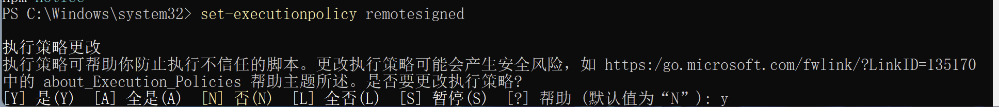

************************************************************************************************************************
1.下载和安装
************************************************************************************************************************

========================================================================================================================
前置条件
========================================================================================================================

- 请确保梯子开启了 tun mode 或类似的功能;
- 为了简化操作, 我使用了 winget, 比较老的 Win10 电脑可能不支持这么做.

========================================================================================================================
安装需要的软件
========================================================================================================================

请通过开始菜单搜索 ``powershell``, 以管理员运行它.

请注意此时窗口中显示的东西, 之后安装好软件时, 它还会再次显示:

在弹出的窗口中输入以下命令并 :KBD:`回车`:

.. hint::

  - 鼠标放在下面代码块的右上角, 有个按钮可以点击复制命令!
  - 注意不要用快捷键 :KBD:`Ctrl-V` 在弹出的窗口中粘贴, 而是要用 :KBD:`右键` 或 :KBD:`右键-Paste` 粘贴!
  - 输入命令后不要忘记 :KBD:`回车`!
  - 如果安装很慢, 请确保梯子开启了 tun mode 或类似的功能!

下面的脚本将会依次安装以下的组件, 如果本地已安装 **并将其增加到 PATH 环境变量中**, 则可以酌情跳过:

- Visual Studio Code (Microsoft.VisualStudioCode): 要使用的代码编辑器
- Git (Git.Git): 代码库管理
- NodeJS 22 (OpenJS.NodeJS.LTS): :doc:`/tool_and_experience/js_slash_runner/index` 必须
- Python (Python.Python.3.13): :doc:`/tool_and_experience/lorebook_script/index` 必须
- yq (MikeFarah.yq): :doc:`/tool_and_experience/lorebook_script/index` 必须
- ClangFormat (LLVM.ClangFormat): :doc:`/tool_and_experience/lorebook_script/index` 必须

.. code-block:: bash
  :caption: 将会依次安装 VSCode、Git、Python、..., 也许可以去掉电脑上已经有的?

  winget install Microsoft.VisualStudioCode Git.Git Python.Python.3.13 OpenJS.NodeJS.LTS MikeFarah.yq LLVM.ClangFormat

.. hint::
  里面的部分组件的安装可能需要重启才能生效，如果在后续流程中出现 ``找不到yq`` 等问题，建议重启再试试哦。

.. hint::

  此后, 你可以重复以上命令来升级它们.

安装好后, 窗口中将会再次显示你打开窗口时显示过的东西:

接下来输入以下命令并 :KBD:`回车`, 然后输入 ``y`` 再 :KBD:`回车`:

.. code-block:: bash

  set-executionpolicy remotesigned

关闭并重新打开 ``powershell``, 输入以下命令并 :KBD:`回车`:

.. code-block:: bash

  npm install -g typescript

========================================================================================================================
安装字体 (非必需, 但建议安装!!!)
========================================================================================================================

________________________________________________________________________________________________________________________
安装方法
________________________________________________________________________________________________________________________

.. note::

  以下两步, 如果你的电脑上没有显示文件后缀, 请均尝试一下.

解压缩
  如果文件压缩为 **.zip / .7z / .rar** 文件, 请 :KBD:`右键` 该文件, 然后选择 :KBD:`提取` 以提取文件. 这是系统内置的解压缩方法, 如果有其他压缩软件请随意.

安装
  :KBD:`右键` **.ttf** 或 **.ttc** 文件, 然后选择 :menuselection:`安装` 或 :menuselection:`为所有用户安装`.

________________________________________________________________________________________________________________________
推荐的免费字体
________________________________________________________________________________________________________________________

编辑器英文字体
  - `JetBrains Mono: 在 "Assets" 中找到 JetBrainsMono-版本号.zip 下载 <https://github.com/JetBrains/JetBrainsMono/releases>`_

终端英文字体
  - `MesloLGS NF <https://github.com/ryanoasis/nerd-fonts/releases/download/v3.2.1/Meslo.zip>`_

中文字体
  - `等距更纱黑体 SC: 选择 "Everything Package" 中的 "TTC" 下载 <https://github.com/be5invis/Sarasa-Gothic/releases>`_
