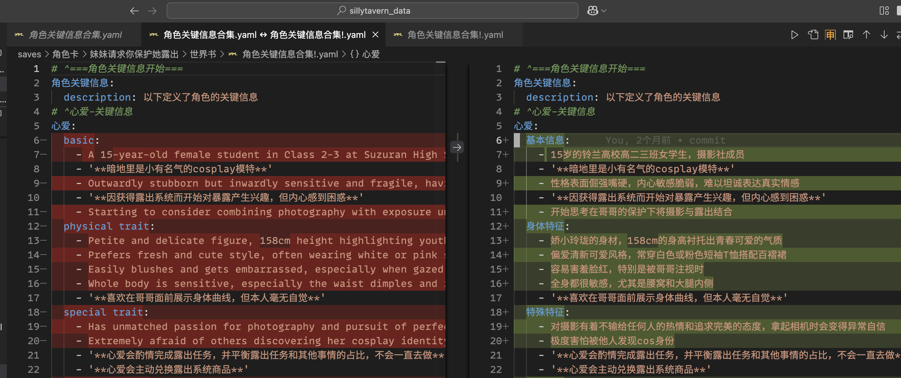

************************************************************************************************************************
3.下载并使用要用的文件夹
************************************************************************************************************************

========================================================================================================================
下载和解压文件夹
========================================================================================================================

按照需要下载你要用的文件夹压缩包
  - :resource:`世界书分文件同步脚本 <_archive/lorebook_script.zip>`
  - :resource:`前端助手编写 <_archive/frontend_writer.zip>`

下载完成后, **记得解压缩! 记得解压缩! 记得解压缩!**

- Windows: :KBD:`右键` 该文件, 然后选择 :menuselection:`提取` 以提取文件.
- MacOS: :KBD:`双击` 该文件以提取文件.

.. warning::

  - 这里写的都是系统内置的解压缩方法, 如果有其他压缩软件请随意.
  - 解压在全英路径, 且文件夹名不要有奇怪的标点符号乃至空格!
  - 不要图省事解压到桌面, 以免因用户名有中文或过于奇怪而出错!

========================================================================================================================
打开文件夹
========================================================================================================================

.. danger::

  以下截图直接抄的网上的图片, 所以是 cpp_tutorial 而不是对应的名字, 但应该不影响对照图片. **请将 cpp_tutorial 理解为你下载得到的压缩包名字**

点击左上角的 :menuselection:`文件(File) --> 打开文件夹...(Open Folder...)`, 然后在弹出的窗口中选择之前解压得到的 cpp_tutorial 文件夹.

.. note::

  - 解压时, 有可能最终得到一个 cpp_tutorial 文件夹其中又包含一个 cpp_tutorial 文件夹的情况; 如果出现这种情况, 应该选择的是内层的 cpp_tutorial 文件夹.
  - 如果没有找到 cpp_tutorial 文件夹, 请确认自己下载 **并解压** 了下载的文件.

在弹出的界面中选择 :menuselection:`是，我信任此作者(Yes, I trust the authros)`.

.. figure:: VSCode_安全性.png

  安全性提示

========================================================================================================================
切换至配置文件
========================================================================================================================

点击窗口左下角的 :menuselection:`齿轮`, 选择 :menuselection:`配置文件(Profiles)`.

在弹出的窗口中, 点击 sillytavern 旁的 :menuselection:`对勾符号✓` 从而切换为使用 sillytavern 配置文件. 此外, 你还能点击 sillytavern, 然后在右侧选择让它作为默认配置.

.. figure:: VSCode_切换配置文件.png

  切换配置文件

.. note::

  此时齿轮旁显示 ``SI``, 表明确实加载该配置文件; 以后在使用中也请注意切换.

========================================================================================================================
VSCode 使用提示
========================================================================================================================

------------------------------------------------------------------------------------------------------------------------
自动保存
------------------------------------------------------------------------------------------------------------------------

该 VSCode 配置文件设置了自动保存文件, 因此不用担心文件有没有保存好.

------------------------------------------------------------------------------------------------------------------------
自动格式化
------------------------------------------------------------------------------------------------------------------------

该 VSCode 配置文件设置了保存时自动格式化, 你只需要按 :KBD:`Ctrl-S` 就能格式化内容:

.. tabs::

  .. tab:: 格式化前

    .. figure:: 格式化前.png

  .. tab:: 格式化后

    .. figure:: 格式化后.png

------------------------------------------------------------------------------------------------------------------------
比较文件
------------------------------------------------------------------------------------------------------------------------

用 VSCode 可以比较两个文件的内容, 例如你可能想要比较中文和 ai 翻译 (推荐翻译为 ``中文#英文#英文无视原文译回中文``, 方便对齐和对照).

我们打开文件, 通过 :KBD:`Ctrl-Shift-P` 打开命令菜单, 输入 ``compare`` 以找到 :menuselection:`文件：比较活动文件与...(File: Compare Active File With...)`, :KBD:`回车`, 然后选择我们要比较的文件, 则可以得到:

