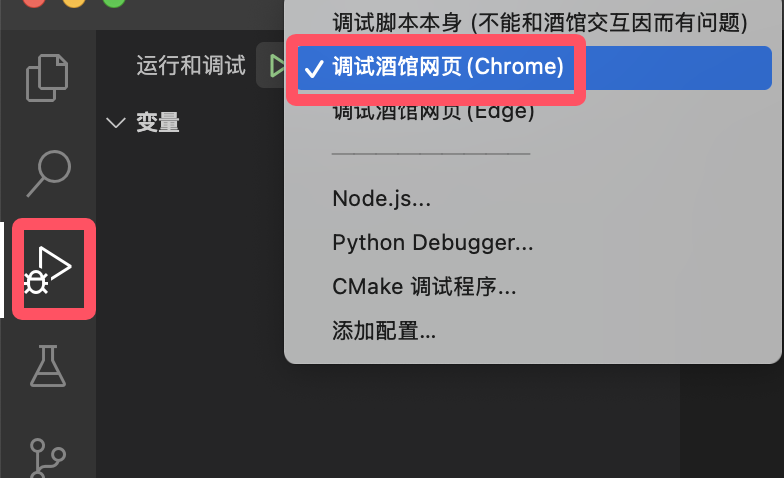

************************************************************************************************************************
开发者: 帮助开发前端助手
************************************************************************************************************************

.. hint::

  建议也去看看 :doc:`../user/index`.

========================================================================================================================
准备 VSCode
========================================================================================================================

------------------------------------------------------------------------------------------------------------------------
克隆代码仓库
------------------------------------------------------------------------------------------------------------------------

首先克隆 `SillyTavern/SillyTavern <https://github.com/SillyTavern/SillyTavern>`_, 在其根目录运行 ``npm install --dev --no-audit --no-fund --no-progress`` 安装开发者所需库从而正常显示酒馆代码的语法高亮.

然后将 `N0VI028/JS-Slash-Runner <https://github.com/N0VI028/JS-Slash-Runner>`_ 克隆到 ``SillyTavern/public/scripts/extensions/third-party`` 文件夹下. 即, ``SillyTavern/public/scripts/extensions/third-party/JS-Slash-Runner/仓库代码``.

------------------------------------------------------------------------------------------------------------------------
用 VSCode 打开文件夹
------------------------------------------------------------------------------------------------------------------------

点击左上角的 :menuselection:`文件(File) --> 打开文件夹...(Open Folder...)`, 然后在弹出的窗口中选择 JS-Slash-Runner 文件夹.

然后, 按之前说过的方式切换 VSCode 配置文件为 sillytavern.

========================================================================================================================
开始编写
========================================================================================================================

项目采用 typescript 编写, 相较于 javascript 有更丰富的静态检查; 当然你也可以在开头加上一句 ``// @ts-nocheck`` 然后当作 javascript 写.

------------------------------------------------------------------------------------------------------------------------
项目结构
------------------------------------------------------------------------------------------------------------------------

所有代码均位于 ``src`` 中, 你只应该对 ``src/iframe_client_exported`` 以外的代码进行修改, 然后运行 ``python compile.py`` 完成修改.

具体请参考 `README_contribution <https://github.com/N0VI028/JS-Slash-Runner/blob/main/README_contribution.md>`_

------------------------------------------------------------------------------------------------------------------------
调试
------------------------------------------------------------------------------------------------------------------------

在文件夹 ``.vscode/launch.json`` 里我预先写了几个调试任务 (填的酒馆默认的端口 8000, 如果改了端口请自行改动 ``launch.json``), 选择对应任务按 :KBD:`F5` 即可进行调试, 当然也可以直接在浏览器用 :KBD:`F12` 调试.

在调试过程中你可以随时用 ``python compile.py`` 重新编译, 刷新网页酒馆就会加载上.

========================================================================================================================
上传 git
========================================================================================================================

在 git 上传之前, 别忘了 ``python compile.py``.