************************************************************************************************************************
编写脚本
************************************************************************************************************************

:resource:`示例角色卡 <前端助手/示例/示例.png>`

你应该在 ``src`` 文件夹中编写你的代码, 该文件夹中默认有对 *楼层消息* 和 *全局脚本* 这两种写法的示例. 此处不会解释这两种用法怎么写, 而是介绍 VSCode 编写它们的流程, 需要对用法等的解释请 **在阅读完本文后** 参考 `N0VI028/JS-Slash-Runner/README_usage <https://github.com/N0VI028/JS-Slash-Runner/blob/main/README_usage.md>`_.

========================================================================================================================
ai 的帮助
========================================================================================================================

请参考 :doc:`Cursor 配置方法 <../../../_vscode/cursor/index>`, 这样一来, 你就能用它自带的免费 ai, 它的 yolo 模式能直接在文件中修改代码等, 你只需要提要求就行了.

前端助手为我们提供了两种与酒馆交互的方法, 此外还有 js 自带的交互方法:

- 直接调用酒馆提供的 slash command 如 ``/inject``, ``/setvar`` 等: ``triggerSlash("/inject ...")`` 或 ``triggerSlashWithResult("/inject ...")``.
- 使用前端助手提供的其他函数: 修改消息 ``setMessages(...)``, 获取角色卡绑定的世界书名称 ``getCurrentCharPrimaryLorebook(...)``.
- js 可以访问/修改 html 上的 DOM 元素, 从而与酒馆交互: 例如, 你可以用 ``$(`div.mes[mesid = "${message_id}"]`, window.parent.document).find(`div.mes_text`);`` 来获取 ``message_id`` 楼层的消息内容.

为了让 ai 理解这些方式, 请将 frontend_writer 中的

- tsconfig.json 文件
- slash_command.txt 文件
- iframe_client 文件夹

发给 ai, 并要求它参考 ``楼层消息v1_复制粘贴代码`` (或 ``全局脚本v1_复制粘贴代码``) 进行编写, 尤其是不要 ``import module`` 而应该直接使用函数.

========================================================================================================================
为什么是 VSCode?
========================================================================================================================

------------------------------------------------------------------------------------------------------------------------
VSCode 基本功能
------------------------------------------------------------------------------------------------------------------------

我配置好后的 VSCode 支持语法高亮、代码建议、内嵌提示等, 它知道前端助手提供给你了什么功能:

.. tabs::

  .. tab:: 语法高亮

    .. figure:: 语法高亮.png

  .. tab:: 代码建议

    .. figure:: 代码建议.png

  .. tab:: 内嵌提示

    .. figure:: 内嵌提示.png

此外由于写的是 TypeScript 而不是直接写 JavaScript, **无论是你自己还是 ai 都能更容易检查某些错误**:

.. tabs:: 

  .. tab:: TypeScript

    .. figure:: 明显错误-ts.png

  .. tab:: JavaScript

    .. figure:: 明显错误-js.png

**你可以在 iframe_client 文件夹中具体查看前端助手提供给你的功能.**

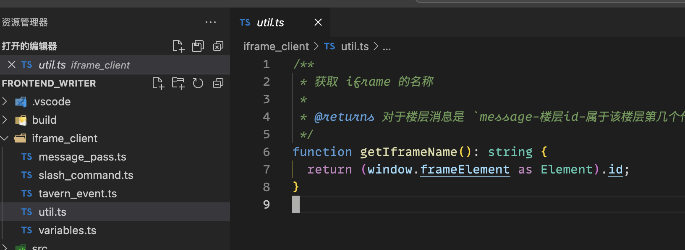

------------------------------------------------------------------------------------------------------------------------
禁用检查
------------------------------------------------------------------------------------------------------------------------

如果不想要检查, 你可以:

.. tabs::

  .. tab:: 禁用整个文件的检查

    .. figure:: 禁用整个文件的检查.png

  .. tab::  禁用某一行的检查

    .. figure:: 禁用某一行的检查.png

此外, 我默认开的检查选项比较严格, 不知道 ai 帮忙写起来如何, 你也许可以在 tsconfig.json 中将 ``strict: "true",`` 改为 ``strict: "false",``.

------------------------------------------------------------------------------------------------------------------------
查看更多报错
------------------------------------------------------------------------------------------------------------------------

行间只能显示一个错误, 因而有时候并不完整, 我们还可以通过 :menuselection:`问题` 面板和 :KBD:`鼠标悬停` 在诊断划线位置, 来了解更多信息:

.. tabs::

  .. tab:: 问题面板

    如果没有显示出面板, 你可以通过 :KBD:`Ctrl-J` 或 :KBD:`Command⌘-J` 打开.

    .. figure:: 问题面板.png

  .. tab:: 鼠标悬停

    除了鼠标悬停, 你也可以用 :KBD:`Ctrl-K Ctrl-I` 或 :KBD:`Command⌘-K Command⌘-I` 打开光标位置的悬停提示 (editor.action.showHover), 但这默认快捷键很复杂, 建议查询并修改快捷键.

    .. figure:: 鼠标悬停.png

------------------------------------------------------------------------------------------------------------------------
其他功能
------------------------------------------------------------------------------------------------------------------------

其他功能我暂时想不起来, 请自行查询?

- :KBD:`F2` 一键重命名光标所在的变量名;
- :KBD:`Ctrl+鼠标左键` 或 :KBD:`F12` 或 :KBD:`Shift+F12` 跳转类型定义或变量被使用的地方;
- :KBD:`Ctrl+Shift+空格` 手动唤醒函数提示.

========================================================================================================================
实际编写
========================================================================================================================

导入 :resource:`示例角色卡 <前端助手/示例/示例.png>` 后, 我们打开局部正则将会看到 6 个正则, 对应于 VSCode 中 src 文件夹下的 6 个文件夹中的 放入正则的内容.md 文件, 而其中 2 个被启用:

- (启用) 楼层消息-v1-复制粘贴代码
- 楼层消息-v2-使用链接实时修改html
- 楼层消息-v3-拆分脚本并实时修改
- 楼层消息-v4-用JQuery简化
- (启用) 脚本-v1-复制粘贴代码
- 脚本-v2-使用链接实时修改脚本

这个被启用的 "复制粘贴代码" 版正则将是我们发布角色卡时应该使用的正则, 你可以测试发现:

- 由于 "楼层消息-v1-复制粘贴代码" 被开启, 第一条消息中会有一个按钮, 点击后将会弹出 ``你点击了按钮！`` 提示.
- 由于 "脚本-v1-复制粘贴代码" 被开启, 当你编辑消息然后确认或取消编辑后, 将会弹出 ``你刚刚修改了第 ${message_id} 条聊天消息对吧😡`` 提示.

那么另外 4 个正则有什么作用呢? 它将允许我们在 VSCode 中实时修改内容, 只需刷新网页即可使用修改后的内容, 而不需要手动复制粘贴到酒馆中.

接下来我以如何让楼层消息做到实时更新为例, 解释整个过程.

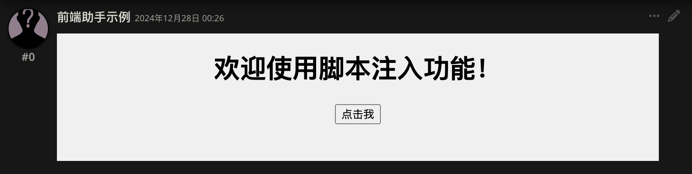

------------------------------------------------------------------------------------------------------------------------
html 结构 (v1-复制粘贴代码)
------------------------------------------------------------------------------------------------------------------------

在 "楼层消息-v1-复制粘贴代码" 中有以下内容 (省略开头和结尾的 :code:`\`\`\``):

.. code-block:: html
  :linenos:

  <html>

  <head>
    
  </head>

  <body>
    <h1>欢迎使用脚本注入功能！</h1>
    <button onclick="showMessage()">点击我</button>
    
  </body>

  </html>

可以注意到, html 使用 ``<tag>...</tag>`` 来表示其中的 ``...`` 属于某个 tag. 我们因而看到了,

- 最外层的 ``<html>...</html>`` 来表示它是整个页面;
- ``<head>...</head>`` 表示你要告诉浏览器但不会显示出来的信息;
- ``<body>...</body>`` 表示网页要实际显示的内容和一些其他内容.

以此往内, 我们有了别的 tag:

``<h1>`` 和 ``<button>``
  - ``<h1>欢迎使用脚本注入功能！</h1>`` 表示 1 级标题, 所以 ``欢迎使用脚本注入功能！`` 显得比其他字体大很多.
  - ``<button onclick="showMessage()">点击我</button>`` 顾名思义表示按钮, 而按钮显示的内容是 ``点击我``. ``onclick`` 部分我们之后解释.

```` 之中是 CSS 代码, 它会向浏览器描述该怎么显示对应的内容.

  什么意思呢? 刚刚说过, ``<body>...</body>`` 中会包含网页要实际显示的内容, 在这里就是包含了 ``<h1>欢迎使用脚本注入功能！</h1>`` 和 ``<button onclick="showMessage()">点击我</button>``. **但我们在 <body> 中从来没说过背景应该是白色、文字应该居中等等, 它却那么显示了!** 这正是 CSS 在为我们描述的:

  .. code-block:: html
    :linenos:

    

  也就是说, 在 ``<body>`` 中我们只需要描述各处应该有的文本, 而具体的显示样式将由 ``
    </head>

    <body>
      <h1>欢迎使用脚本注入功能！</h1>
      <button>点击我</button>
    </body>

    </html>

  .. figure:: 楼层消息显示-调整css.png

``

综上所述:

- ``<html>...</html>`` 内是一个完整的网页.
- ``<head>...</head>`` 内是要在 ``<body>`` 被显示前让浏览器了解但不显示的内容.

  - ```` 内是 CSS 代码, 描述网页的具体样式. 我们当然要在浏览器显示 ``<body>`` 之前就让它知道 ``<body>`` 的具体样式, 因而放在了 ``<head>`` 中.

- ``<body>...</body>`` 内是要实际显示的内容和一些其他内容.

  - ```` 内是一些 JavaScript 脚本代码, 它可能会自动运行, 也可能像示例那样, 被用户的某些操作 (如点击按钮) 触发.

.. hint::

  请打开 "脚本-v1-复制粘贴代码". 注意到了吗? "脚本-v1-复制粘贴代码" 中只有 ```` 而没有其他内容, 连 :code:`\`\`\`` 都没有. 这就是楼层消息 iframe 和全局脚本 iframe 的显著区别:

  - 楼层消息 iframe 以正则替换的方式显示到各楼层中, 它会有实际需要显示的内容. 为了前端助手能知道它是楼层消息 iframe, 我们要求的格式是 :code:`\`\`\`` 包裹起来, 并且其中有 ``<body>...</body>``.
  - 全局脚本 iframe 并没有进行正则替换, 选择放在正则中只是因为角色卡导出时也会到处正则. 它只会有一个或多个 ````, 在切换聊天时会被加载到后台, 运行其中存储的 JavaScript 脚本代码.

了解了 html 的结构再配合 ai, 你其实已经有了编写前端助手角色卡的能力, **但你不得不在每次修改后将内容重新复制粘贴到正则中**.

使用 VSCode 将能避免这一点: 在 VSCode 中修改文件后, 你只需要刷新酒馆, 酒馆就能加载修改后的文件. 但要做到这一点, 需要额外的步骤.

------------------------------------------------------------------------------------------------------------------------
运行调试任务 (v2-使用链接实时修改 html)
------------------------------------------------------------------------------------------------------------------------

.. error::

  你必须安装 Chrome 或 Edge 浏览器才能使用 VSCode 的调试功能.

.. error::

  在之前提供的 Profile 中, 可能有 ``Live Server`` 没能成功安装的情况。此时你需要手动进行安装,  `这是链接 <https://marketplace.visualstudio.com/items?itemName=ritwickdey.LiveServer>`

.. note::

  如果你的酒馆端口不是默认的 8000, 请在 ``.vscode/launch.json`` 中调整 ``"url"``.

首先我们要选择 Chrome 或 Edge 浏览器对应的调试任务

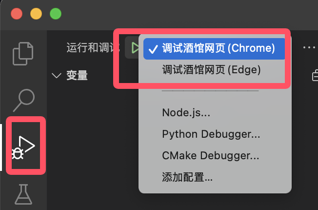

此后, 按下 :KBD:`F5` 即可启动调试.

启动调试后将会弹出两个页面.

.. note::

  这时 VSCode 上可能会报错 ``error TS2688: Cannot find type definition file for 'xxx'``, 这是正常的. **请继续阅读完本教程的所有页面.**

  .. figure:: 找不到类型文件.png

其中一个是酒馆网页. 我们的调试操作必须在这个弹出的酒馆网页中进行, 而不能随便用一个打开的酒馆网页; 一旦关闭这个酒馆网页, 调试任务就会关闭.

另一个是 Live Server 插件将我们本地文件夹映射到了端口 (一般端口号为 5500) 后弹出的网页. 这样映射以后, frontend_writer 文件夹中 (仅限于这个文件夹中!!!) 的文件将能以 ``http:://localhost:5500/文件相对于 frontend_writer 文件夹的路径`` 的方式访问.

.. hint::

  不清楚相对路径是多少? :KBD:`右键` 文件, 点击 :KBD:`复制相对路径`.

  .. figure:: 复制相对路径.png

例如, 要访问 src 文件夹下的 楼层消息v2_使用链接实时修改html 文件夹下的 楼层消息.html 文件, 我们可以用 ``http:://localhost:5500/src/楼层消息v2_使用链接实时修改html/楼层消息.html`` 来访问.

.. figure:: liveserver映射.png

这个地址是对文件的直接映射, **这意味着我们更改文件内容后, 这个地址对应的文件内容也会实时更新** (当然可能需要刷新网页). 那么, 如果有一种方法允许我们直接在酒馆中嵌入这个链接, 而不是复制文件内容过去呢? 这是否意味着我们将能在 VSCode 编辑文件内容, 而酒馆中只需要刷新一下, 就会使用更新后的文件内容?

所以遗留给我们的问题是: 如何在酒馆中嵌入这个链接?

```` 中的 JavaScript 脚本代码除了被 ``<button onlick="showMessage()">点击我</script>`` 这样的按钮点击事件触发外, 还能自动运行. 让我们把 ``alert("你点击了按钮！");`` 放到外面来试试 (别忘了在开头和末尾加上一行 :code:`\`\`\``):

.. code-block:: html
  :linenos:

  <html>

  <head>
    
  </head>

  <body>
    <h1>欢迎使用脚本注入功能！</h1>
    
  </body>

  </html>

当我们将正则换为这个内容后 (当然别忘了在顶部和底部加上一行 :code:`\`\`\``), 当窗口渲染完毕时, 你直接得到了一条 ``"你好！"`` 提示.

这对我们的现状有什么帮助? JavaScript 脚本代码能直接对文档内容进行直接修改, 因此我们可以用 JavaScript 获取 ``http:://localhost:5500/src/楼层消息v2_使用链接实时修改html/楼层消息.html`` 并显示它的内容, 从而让酒馆嵌入这个链接 (别忘了在开头和末尾加上一行 :code:`\`\`\``):

.. code-block:: html
  :linenos:
  :emphasize-lines: 19-20

  <body>
    
  </body>

虽然整个代码看起来很多, 但实际你只需要将其中的 ``http:://localhost:5500/src/楼层消息v2_使用链接实时修改html/楼层消息.html`` 换成你想测试的 html 文件对应的链接即可. 在之后我会给出一种改进写法.

-----------------------------------------------------------------------------------------------------------------------
实时修改脚本内容 (v3-拆分脚本并实时修改)
------------------------------------------------------------------------------------------------------------------------

我们虽然做到了 html 的实时修改, 但这还不够方便: ```` 部分的 JavaScript 代码有时候非常复杂 (不信吗? 去看看论坛的那些前端卡正则😨), 将它们拆开来写会方便很多, 也会让 VSCode 和 ai 更容易帮助你.

我们将 ```` 全部照抄到一个 ``.ts`` 结尾的文件中, 在此即 楼层消息v3_拆分脚本并实时修改 文件夹中的 楼层消息.ts 文件, 则它的地址应该是 ``http:://localhost:5500/src/楼层消息v3_拆分脚本并实时修改/楼层消息.ts``.

通过 ```` 的形式, 我们可以从链接引用脚本文件. 由此, html 可以使用映射到 5500 端口的脚本链接, 而非复制粘贴嵌入该脚本:

.. code-block:: html
  :linenos:
  :emphasize-lines: 18

  <html>

  <head>
    
  </head>

  <body>
    <h1>欢迎使用脚本注入功能！</h1>
    <button onclick="showMessage()">点击我</button>
    
  </body>

  </html>

而我们在正则中还是和之前一样, 填入对应 html 的链接 (别忘了在开头和末尾加上一行 :code:`\`\`\``):

.. warning::

  以下正则是 ai 代写, 在本地酒馆用它没有问题. 但如果你想要远程编写角色卡, 因而地址是 ``http://你的远程服务器ip:5500`` 这样的地址, 则你需要继续阅读, 使用 v4 版本.

.. code-block:: html
  :linenos:
  :emphasize-lines: 20

  <body>
    
  </body>

但这并没有成功. 为了让 VSCode 和 ai 提供更多帮助, 我刚刚是让你新建一个 .ts 文件, 编写 TypeScript 而非 JavaScript 代码; 而 ```` 仅支持 JavaScript 代码. 因此, 我们要先将 TypeScript 转换成 JavaScript 代码.

**你已经转换好了!** 我配置了一个自动任务, 会在你按下 :KBD:`F5` 而进入调试任务后自动将 src 文件夹中的 .ts 文件转换为 .js 文件. 只要你处于调试状态, 这个 .js 文件就是最新的版本. 你唯一要做的是将原本的 .ts 文件链接换成使用 .js 文件链接.

现在让我告诉你 .js 文件在哪: 它在 build 文件夹中. 你可以自行去找它然后复制相对路径来得到它的链接, 也可以直接从 ``http://localhost:5500/src/楼层消息v3_拆分脚本并实时修改/楼层消息.ts`` 得到:

- 在 ``http://localhost:5500/`` 后面加上 ``build/``;
- 将 ``.ts`` 改为 ``.js``.

也就是说, ``http://localhost:5500/src/楼层消息v3_拆分脚本并实时修改/楼层消息.ts`` 对应的 .js 文件链接为 ``http://localhost:5500/build/src/楼层消息v3_拆分脚本并实时修改/楼层消息.js``.

现在让我们修正之前的 html, 嵌入正确的 js 链接:

.. code-block:: html
  :linenos:
  :emphasize-lines: 18

  <html>

  <head>
    
  </head>

  <body>
    <h1>欢迎使用脚本注入功能！</h1>
    <button onclick="showMessage()">点击我</button>
    
  </body>

  </html>

------------------------------------------------------------------------------------------------------------------------
使用第三方库 (v4-用 JQuery 简化)
------------------------------------------------------------------------------------------------------------------------

既然 ```` 能够使用 ``http:://localhost:5500/文件相对于 frontend_writer 文件夹的路径``, 那么能不能用于网上的链接呢? 自然是可以的. 你可以去 `cdnjs <https://cdnjs.com/>`_ 等网站查找对应的第三方库链接, 然后嵌入到代码中.

例如, 我们可以用 ```` 引入 JQuery 库来简化之前嵌入 html 链接的方法:

.. tabs::

  .. tab:: 只使用 JavaScript 本体

    .. code-block:: html
      :linenos:

      <body>
        
      </body>

  .. tab:: 使用 JQuery

    .. code-block:: html
      :linenos:

      <body>
        
        
      </body>

    .. hint::

      最新版前端插件已经默认添加了 JQuery 库, 你甚至可以略去 ```` 一行: (当然如果你要像之后说明的那样在 VSCode 中直接预览网页, 还是需要加上这一行)

      .. code-block:: html
        :linenos:

        <body>
          
        </body>

但是这样引入的第三方库没有语法高亮, 甚至使用会报错.

为了让 VSCode 支持第三方库的语法解析, 请在 VSCode 中按 :KBD:`Ctrl-Shift-P` 打开命令菜单, 输入 ``toggle terminal`` 以找到 :menuselection:`查看: 切换 终端`, :KBD:`回车` 从而打开 :menuselection:`终端`. 在 ``开始监视所有js和ts - 任务之外`` 新建一个终端 (见图).

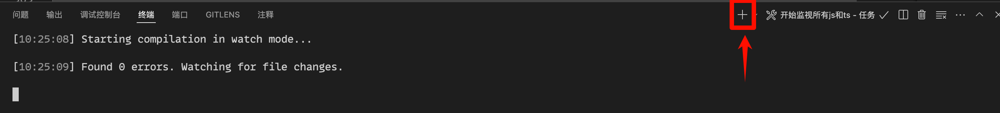

然后对于你使用的第三方库名称, 输入以下内容并 :KBD:`回车`:

.. code-block:: bash

  npm install --save-dev @types/你使用的第三方库名称

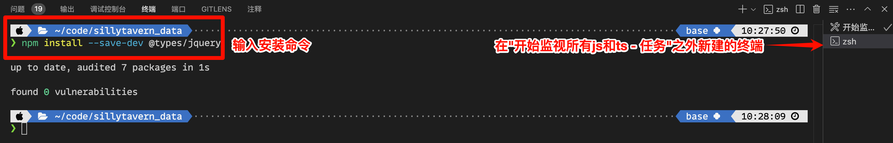

然后修改 tsconfig.json, 在 ``"types"`` 中添加 ``"你使用的第三方库名称",``:

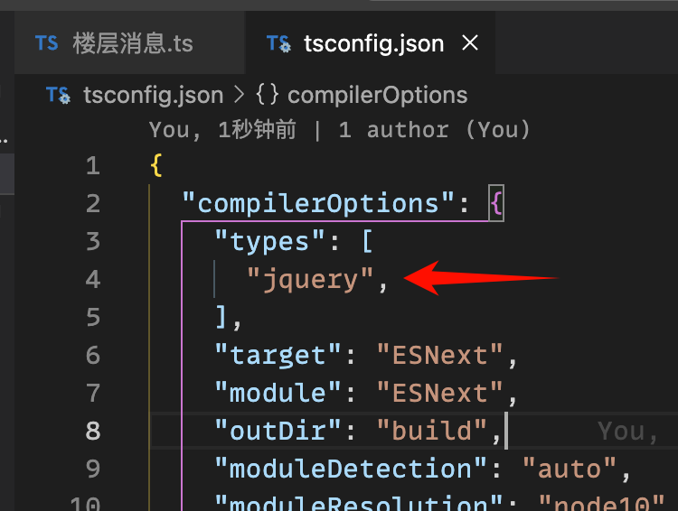

.. hint::

  `前端助手内置了一些第三方库 <https://github.com/N0VI028/JS-Slash-Runner/blob/main/README_usage.md#内置的第三方库>`_, 建议都按上面的操作安装上, 具体见于 :doc:`../update/index`.

.. warning::

  经实际体验, 有的第三方库提供的 ``@types`` 语法解析不一定对, 请尽量先试一下再使用第三方库, 免得以后难以找到哪里出了问题.

------------------------------------------------------------------------------------------------------------------------
实时修改全局脚本
------------------------------------------------------------------------------------------------------------------------

和实时修改楼层消息的方式差不多, 请自行参考示例和示例角色卡.

========================================================================================================================
调试的其他功能
========================================================================================================================

------------------------------------------------------------------------------------------------------------------------
查看控制台
------------------------------------------------------------------------------------------------------------------------

我们可以通过 VSCode 下方面板的 :menuselection:`调试控制台` 查看酒馆运行的日志 (由代码中的 ``console.info`` 等输出).

.. note::

  如果没有显示出面板, 你可以通过 :KBD:`Ctrl-J` 或 :KBD:`Command⌘-J` 打开.

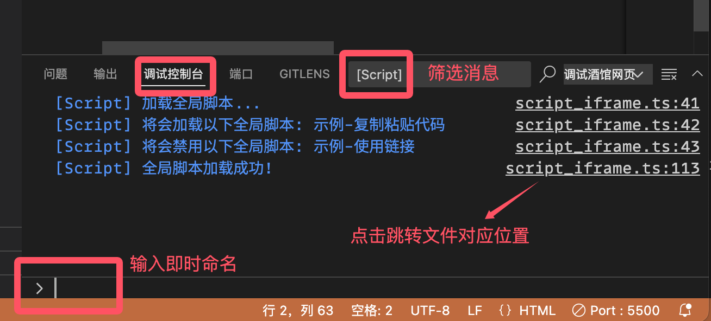

.. note::

  你也可以在浏览器按下 :KBD:`F12`, 然后点击 :menuselection:`控制台` 来查看. 你可以启用日志级别, 来查看酒馆的更多日志 (如哪些酒馆事件被触发).

  .. figure:: 控制台-浏览器.png

------------------------------------------------------------------------------------------------------------------------
断点调试
------------------------------------------------------------------------------------------------------------------------

在调试过程中, 我们可以在代码行号左边 :KBD:`鼠标左击` 来设置断点. 具体地, 设置断点后, 当酒馆执行到这部分代码时将会暂停 (你需要保证自己是以链接形式将代码放入酒馆的), 等待你当时的情况、进行想要的操作.

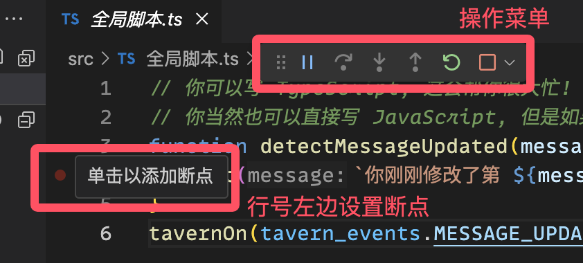

.. note::

  你也可以在浏览器按下 :KBD:`F12`, 然后点击 :menuselection:`源代码/来源` 来使用. **浏览器上甚至支持对你复制粘贴过去的代码的调试.**

  .. figure:: 断点调试-浏览器.png

例如,

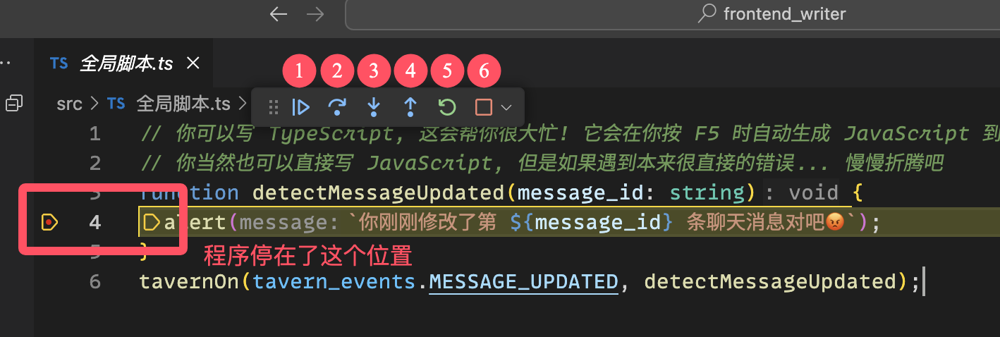

其中序号依次是: (很难给不了解函数的人解释, 如果想了解, 请自己试试这些功能)

#. :guilabel:`执行调试/继续`: 继续执行程序直到中断.
#. :guilabel:`逐过程`: 像正常执行程序一样一句句执行, 遇到函数调用时会直接完全执行该函数, 不调试函数内部.
#. :guilabel:`逐语句`: 像正常执行程序一样一句句执行, 如果遇到函数调用则进入函数内部进行调试.
#. :guilabel:`跳出`: 执行直到当前函数返回, 回到调用该函数的函数中.
#. :guilabel:`重启`: 重启程序.
#. :guilabel:`停止`: 停止执行程序, 即结束调试.

但是楼层消息在每一层都会触发断点, 而我们只想调试某一层, 这该怎么办? 我们 :KBD:`鼠标右击` 设置好的断点, 选择 :menuselection:`编辑断点...` 即可选择特殊断点:

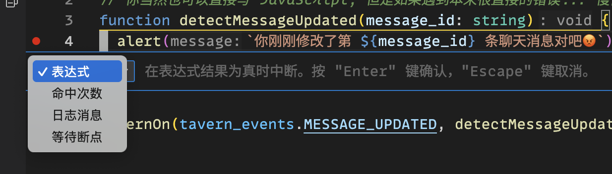

#. :guilabel:`表达式`: 满足某个条件时触发断点, 如 ``i == 0``. (想要对应楼层吗? ``getIframeName()`` 可以帮上你!)
#. :guilabel:`命中次数`: 断点所在代码被运行达到一定次数后触发断点.
#. :guilabel:`日志消息`: 要求命中断点时输出自定义的消息.
#. :guilabel:`等待断点`: 等待另一个断点被触发过后允许触发本断点.

========================================================================================================================
其他提示
========================================================================================================================

------------------------------------------------------------------------------------------------------------------------
预览 html
------------------------------------------------------------------------------------------------------------------------

你可以在 VSCode 中直接预览 html 文件. 当然由于只是预览单个 html 文件, 你没办法使用与酒馆相关的功能, **但如果你只是想设计样式, 这会很好用**.

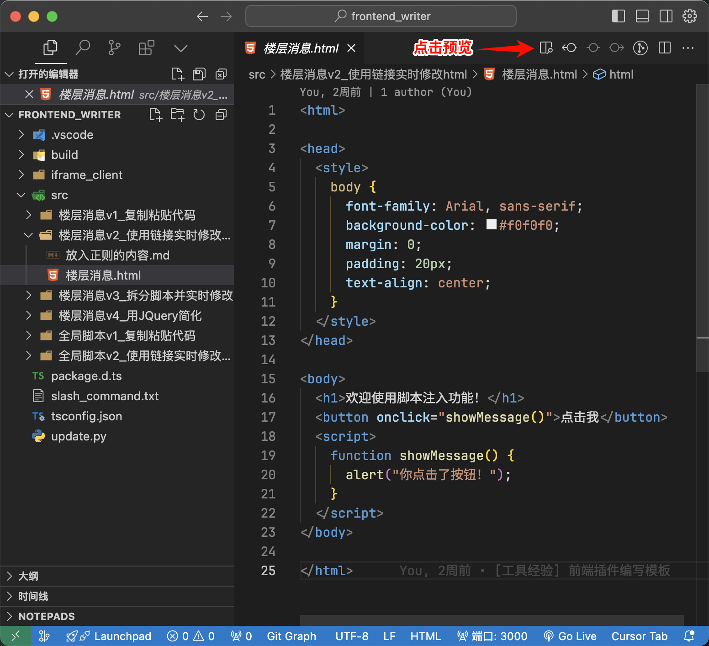

需要注意的是, 如果你不使用前端助手的方式在代码块中显示 html, 而是直接将 html 显示到酒馆中, 那么 VSCode 显示的样式会和酒馆显示的样式有些差异.

例如, 以下内容在 VSCode 中能正常显示, 而酒馆中无法显示文字:

.. tabs::

  .. tab:: VSCode

    .. figure:: 预览html_酒馆无法正常显示_vscode.png

  .. tab:: 酒馆

    .. figure:: 预览html_酒馆无法正常显示_酒馆.png

为什么呢? **我也不知道!** 但我们将 ``content`` 的双引号改为单引号后, 就能正常显示:

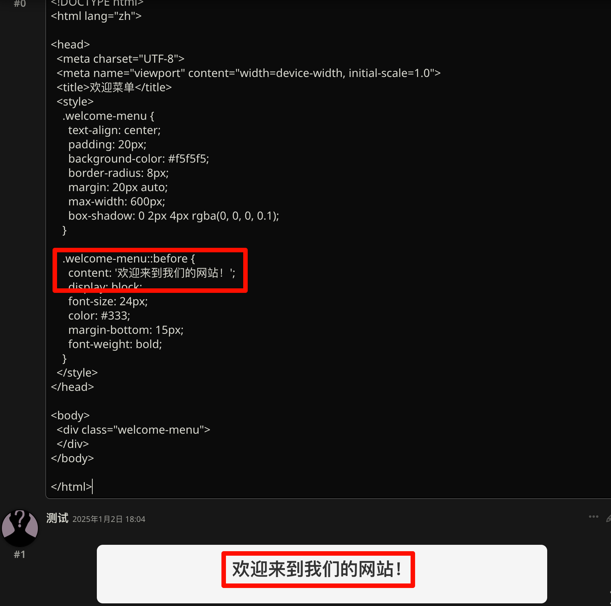

当然这里说的是直接在酒馆里显示会有差异, 如果我们用前端助手的方式在代码块里显示 html, 那么将会是一模一样的:

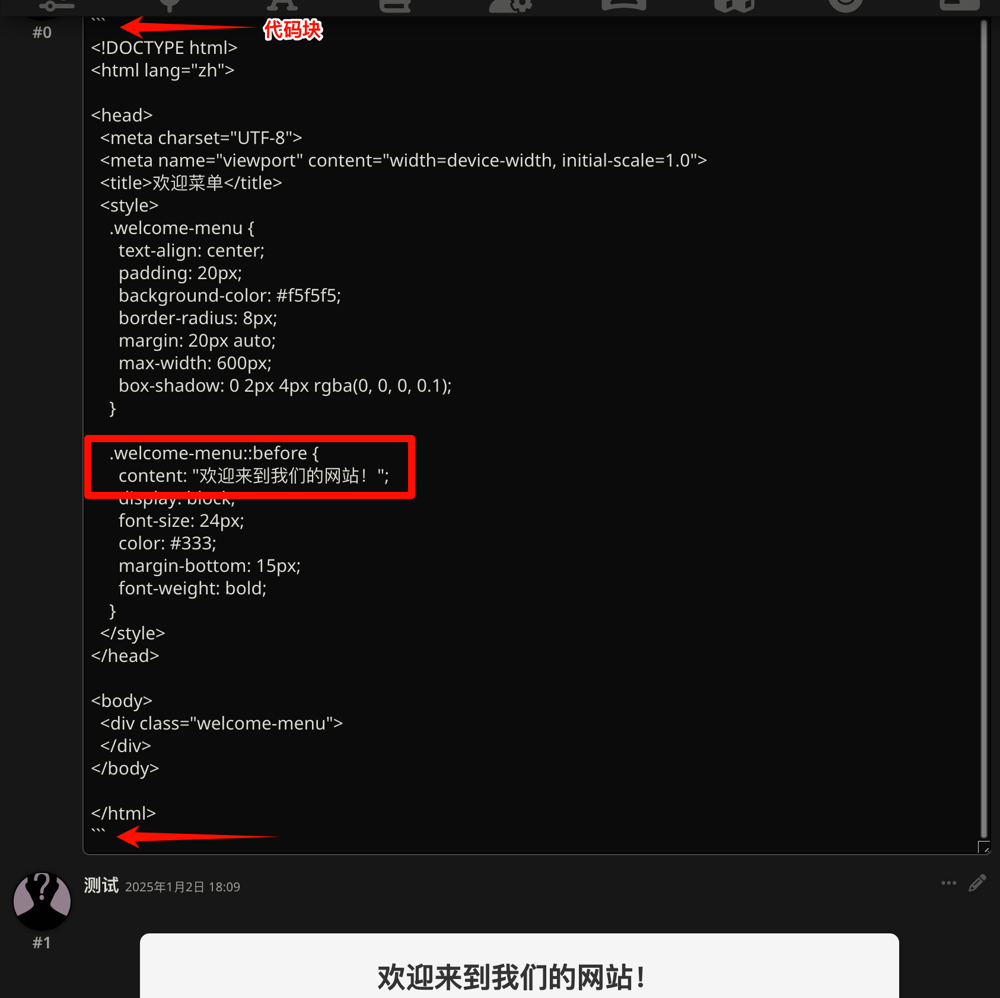

`前端助手内置了一些第三方库 <https://github.com/N0VI028/JS-Slash-Runner/blob/main/README_usage.md#内置的第三方库>`_, 如果需要在 VSCode 预览中正确使用, 你应该手动插入它们, 具体见 :doc:`../update/index`.

------------------------------------------------------------------------------------------------------------------------
时间线
------------------------------------------------------------------------------------------------------------------------

虽然我更建议你直接通过 `Learn Git Branching <https://learngitbranching.js.org/?locale=zh_CN>`_ 学习 Git, 但做不到也没事, VSCode 自带了回溯功能.

点开侧边栏的时间线, 你就能看到它:

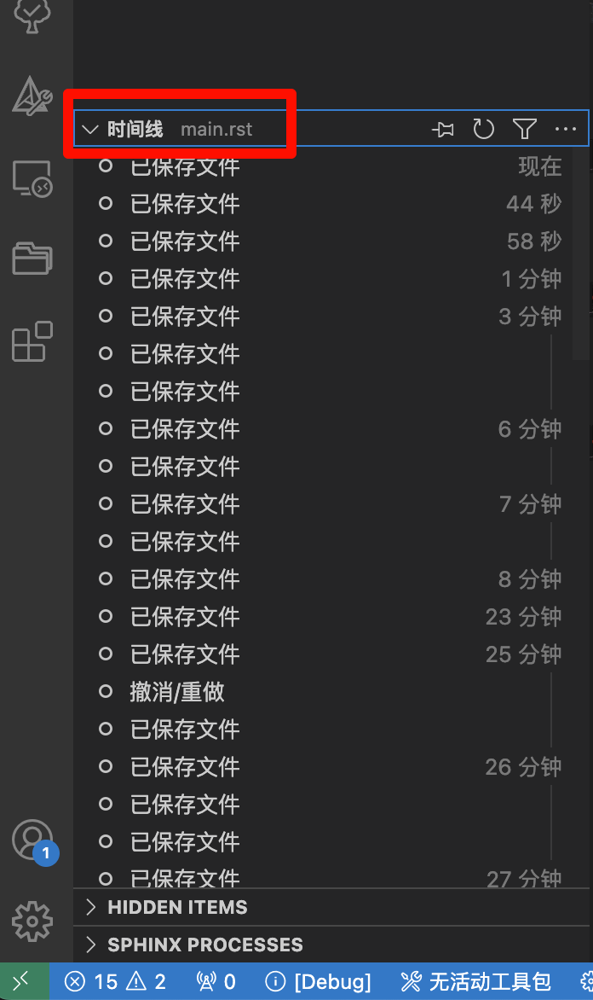

注意, VSCode 时间线只能记录它上面的更改, 如果你在软件之外修改了文件, 那么无药可救.

但是你已经不小心删掉了文件? 别担心, **我们新建一个同名的文件, 就又能看到时间线了**.

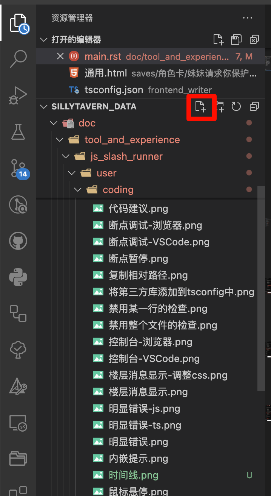
