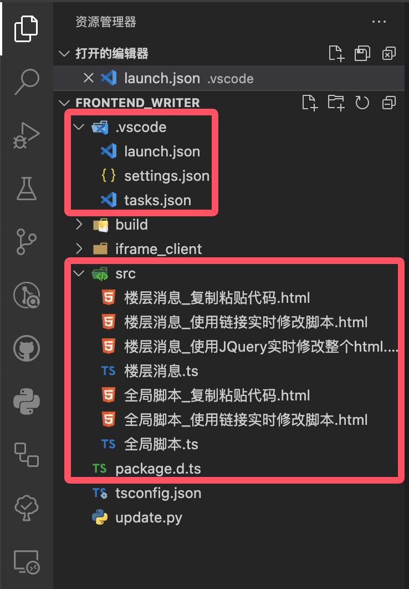

************************************************************************************************************************
准备 VSCode
************************************************************************************************************************

请打开 frontend_writer 文件夹, 注意如果 frontend_writer 里嵌套了一个 frontend_writer 文件夹, 则应该开内层那个. 如下图所示, 红框是你 (可能) 需要在意的文件, 其他的部分不用在意.

然后, 按之前说过的方式切换 VSCode 配置文件为 sillytavern.