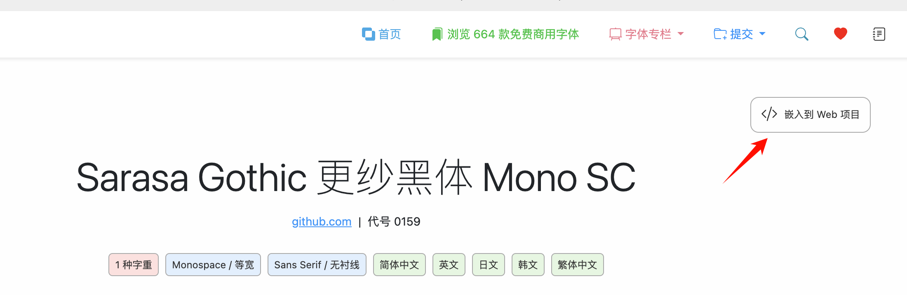
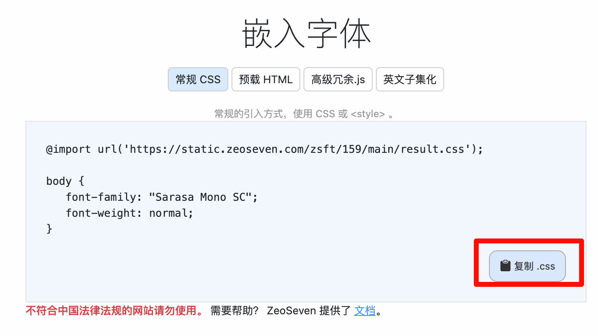

************************************************************************************************************************
常用资源网站
************************************************************************************************************************

========================================================================================================================
免费字体
========================================================================================================================

在 https://fonts.zeoseven.com/ 中, 我们可以搜索字体然后在 CSS (````) 中嵌入它们.

以 Sarasa Gothic 更纱黑体 Mono SC 为例, 我们搜索到它, 点击 :menuselection::`嵌入到 Web 项目` 即会跳转到对应内容, 再点击复制即可:

.. code-block:: css

  @import url('https://static.zeoseven.com/zsft/159/main/result.css');

  body {
    font-family: "Sarasa Mono SC";
    font-weight: normal;
  }

========================================================================================================================
第三方库
========================================================================================================================

在 https://cdnjs.com/ 中, 我们可以搜索第三方库然后以 ```` 的形式使用它们 (当然别忘了像 :doc:`../coding/index` 说的那样为它支持语法高亮).

以 yaml 解析库为例, 我们搜索找到合适的库, 点击 :menuselection:`Copy Script Tag` 即可得到对应的嵌入代码:

.. figure:: 第三方库.png

.. code-block:: html

  