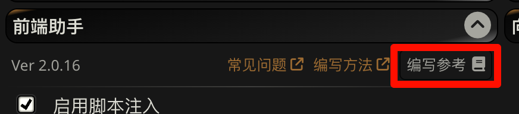
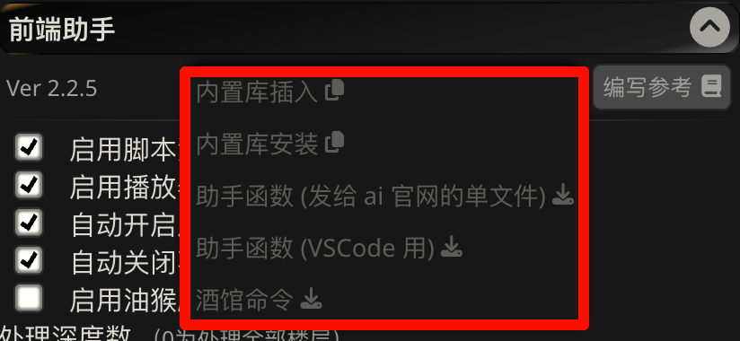
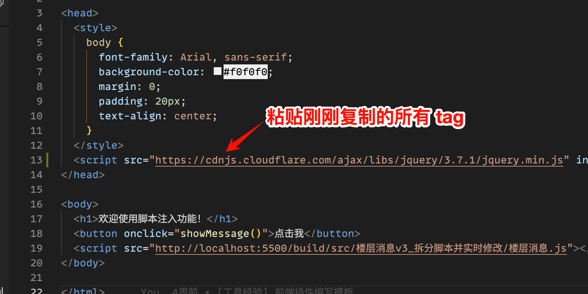
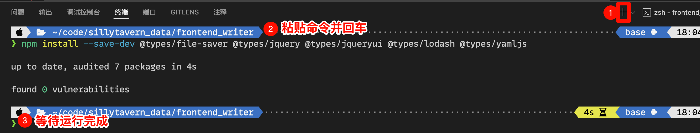
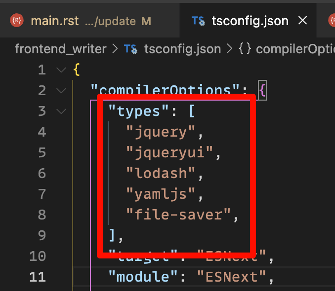

************************************************************************************************************************
前端助手或酒馆更新了?
************************************************************************************************************************

前端助手可能为你加了新的功能, 酒馆可能为你加了新的命令, 为了让新的功能也能得到提示, 你需要更新一下.

为此, 请点开前端助手的设置界面, 点击 :menuselection:`编写参考`:

========================================================================================================================
更新 VSCode 中对 html 的实时预览
========================================================================================================================

首先, 点击 :menuselection:`内置库插入` 来复制内置第三方库插入时的 tag. 例如, 你可能得到:

.. code-block:: html

  

接着, 你需要在 html ``<head>`` 部分的尾部粘贴这些 tag:

========================================================================================================================
更新 VSCode/ai 对内置第三方库的识别
========================================================================================================================

点击 :menuselection:`内置库安装` 来复制内置第三方库的安装命令. 例如, 你可能得到:

.. code-block:: bash

  npm install --save-dev @types/file-saver @types/jquery @types/jqueryui @types/lodash @types/yamljs

在 VSCode 中按 :KBD:`Ctrl-Shift-P` 打开命令菜单, 输入 ``toggle terminal`` 以找到 :menuselection:`查看: 切换 终端`, :KBD:`回车` 从而打开 :menuselection:`终端`, 然后在显示的终端中输入你所获取到的命令并 :KBD:`回车`:

最后, 你需要在 tsconfig.json 中添加这些第三方库:

========================================================================================================================
更新 VSCode/ai 对前端助手和酒馆功能的了解
========================================================================================================================

- 点击 :menuselection:`助手函数 (VSCode 用)` 来获取最新前端助手提供的所有函数;
- 点击 :menuselection:`酒馆命令` 来获取你当前酒馆版本所提供的所有命令.

下载好后, 你可能需要用它们替换 fontend_writer 文件夹下的对应文件.