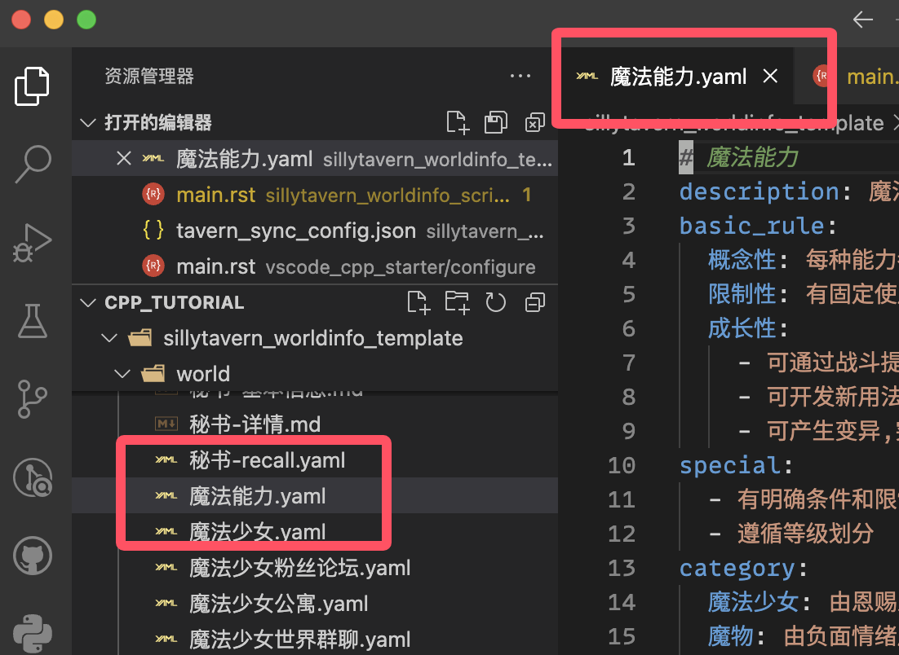
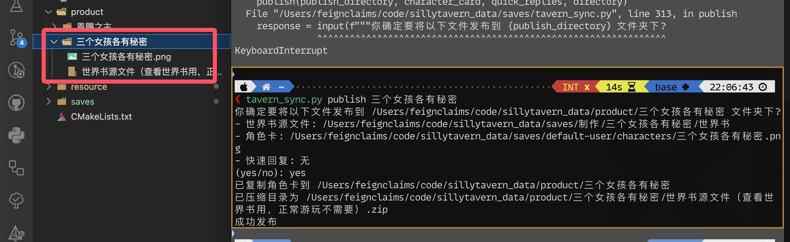

************************************************************************************************************************
脚本用法
************************************************************************************************************************

========================================================================================================================
准备 VSCode
========================================================================================================================

请打开 lorebook_script 文件夹, 注意如果 lorebook_script 里嵌套了一个 lorebook_script 文件夹, 则应该开内层那个.

然后, 按之前说过的方式切换 VSCode 配置文件为 sillytavern.

========================================================================================================================
配置世界书
========================================================================================================================

------------------------------------------------------------------------------------------------------------------------
在配置文件中添加世界书
------------------------------------------------------------------------------------------------------------------------

要使用脚本, 要先在 ``tavern_sync_config.json`` 中告知脚本一些信息:

.. code-block:: json

  {
    "世界书名称": {
      "directory": "独立文件所在文件夹的绝对路径 (现在没有则指定一个空文件夹, 之后可以提取), 如 C:/某世界书独立文件所在的文件夹, 其中 / 也可以换成 \\",
      "json_file": "世界书json文件的绝对路径, 如 C:/SillyTavern/data/default-user/worlds/世界书.json, 其中 / 也可以换成 \\",
      "user_name": "填入你<user>的名字，则同步时会自动将名字替换成<user>"
    },
    "恩赐之主": {
      "directory": "C:/恩赐之主/世界书",
      "json_file": "C:/SillyTavern/data/default-user/worlds/-恩赐之主.json",
      "user_name": "青空莉"
    }
  }

**建议 json_file 直接填存档里的世界书** (默认是 ``你的SillyTavern路径/data/default-user/worlds/世界书名字.json``), 不要导出世界书然后填导出的文件路径. 填存档里的世界书的话, 在更改并同步以后, 刷新酒馆网页就更新上了, 不需要额外操作.

------------------------------------------------------------------------------------------------------------------------
使用脚本的方法
------------------------------------------------------------------------------------------------------------------------

将世界书添加到配置文件后, 你就可以使用脚本.

在 VSCode 中按 :KBD:`Ctrl-Shift-P` 打开命令菜单, 输入 ``toggle terminal`` 以找到 :menuselection:`查看: 切换 终端`, :KBD:`回车` 从而打开 :menuselection:`终端`. 然后你就能以之前配置的 "世界书名称" 使用脚本, 以下我以 "恩赐之主" 为例, 提取出它的世界书条目:

首先我们在打开的 :menuselection:`终端` 输入命令
  .. code-block:: cpp

    python tavern_sync.py extract 恩赐之主

  .. figure:: 输入命令.png

然后我们按 :KBD:`回车` 执行命令
  执行后可能会失败, 请按提示解决问题或查询一下报错

在提取前, 脚本会询问你是否真的要提取, 输入 ``yes`` 并 :KBD:`回车`
  如果运气好, 你已经将条目提取到了 world 中

  .. figure:: 完成命令.png

========================================================================================================================
命令介绍
========================================================================================================================

你可以在终端输入以下命令并 :KBD:`回车`, 来查看有哪些命令可供使用:

.. code-block:: bash

  python tavern_sync.py -h

你可以在终端输入以下命令并 :KBD:`回车`, 来查看对应的命令如何使用:

.. code-block:: bash

  python tavern_sync.py extract -h

------------------------------------------------------------------------------------------------------------------------
提取 (extract)
------------------------------------------------------------------------------------------------------------------------

.. note::

  **如果你的世界书还没有创建, 那么不需要进行提取.** 直接在配置文件里填好设置, 在设置的 `directory` 文件夹里按 :doc:`要求 </tool_and_experience/lorebook_script/file_format/index>` 写独立文件, 然后用 push、pull 指令就能同步了.

该命令允许你将世界书文件中的条目提取成独立文件, 从而开始用这个脚本管理世界书.

.. code-block:: bash

  python tavern_sync.py extract 恩赐之主

默认情况下, 脚本在提取时会自动检测内容是否是 yaml 或 json 格式, 进而用对应的格式提取.

  提取时自动转换为了 yaml 格式

你可以加上参数 ``--no_detect`` 来禁用这样的自动检测, 则所有条目都会被提取成 ".md" 文件.

.. code-block:: bash

  python tavern_sync.py extract 恩赐之主 --no_detect

.. warning::

  条目名如果有 ``/`` 或 ``[]`` 等英文输入法下的符号 (半角符号) 可能会提取失败.

------------------------------------------------------------------------------------------------------------------------
推送 (push)
------------------------------------------------------------------------------------------------------------------------

该命令允许你将独立文件中的内容同步到世界书文件中. **如果你正在用酒馆, 推送后请记得刷新网页**; 如果你要导出角色卡, 建议刷新页面后, :doc:`先解除世界书绑定再重新绑定 </common_issue/export_updated_card/index>`.

.. code-block:: bash

  python tavern_sync.py push 恩赐之主

默认情况下, 推送会将所有 yaml 和 json 文件压缩成最省 token 的形式.

.. tabs::

  .. tab:: 推送内容

    .. figure:: 推送内容.png

  .. tab:: 推送结果

    .. figure:: 推送结果.png

你可以加上参数 ``--no_trim`` 来禁用这样的压缩, 则条目将会被原封不动地推送.

------------------------------------------------------------------------------------------------------------------------
拉取 (pull)
------------------------------------------------------------------------------------------------------------------------

该命令允许你将世界书文件中的内容同步到独立文件中.

与提取只是将世界书条目抽取成一个个独立文件不同, 拉取支持我设定的 :doc:`/tool_and_experience/lorebook_script/file_format/index`, 更具有灵活性.

.. code-block:: bash

  python tavern_sync.py pull 恩赐之主

------------------------------------------------------------------------------------------------------------------------
打包 (publish)
------------------------------------------------------------------------------------------------------------------------

该命令允许你将世界书独立文件、角色卡和快速回复打包.

这需要你在配置文件中额外告诉一些信息: (不需要可以不配置)

.. code-block:: json

  {
    "世界书名称（带发布功能）": {
      "directory": "分开的各条目文件所在的文件夹, 如 C:/某世界书分文件文件夹, 其中 / 也可以换成 \\",
      "json_file": "世界书json文件的绝对路径, 如 C:/SillyTavern/data/default-user/worlds/世界书.json, 其中 / 也可以换成 \\",
      "user_name": "填入你<user>的名字，则同步时会自动将名字替换成<user>",

      "publish_directory": "要打包到的文件夹路径，如 C:/",
      "character_card": "角色卡路径，如 C:/SillyTavern/data/default-user/characters/角色卡.png",
      "script_directory": "存放前端助手脚本的文件夹, 如果没有可以不写 `script_directory`，如 C:/frontend_writer",
      "quick_replies": [
        "快速回复路径1，没有可以一个都不填，如 C:/SillyTavern/data/default-user/QuickReplies/快速回复.json",
        "快速回复路径2"
      ]
    },
    "三个女孩各有秘密": {
      "directory": "C:/三个女孩各有秘密/世界书",
      "json_file": "C:/SillyTavern/data/default-user/worlds/-三个女孩各有秘密.json",,
      "user_name": "青空莉"
      "publish_directory": "C:/",
      "character_card": "C:/SillyTavern/data/default-user/characters/三个女孩各有秘密.png",
      "script_directory": "C:/frontend_writer",
      "quick_replies": [
        "C:/SillyTavern/data/default-user/QuickReplies/场景感.json"
      ]
    }
  }

.. code-block:: bash

  python tavern_sync.py publish 三个女孩各有秘密

  发布结果

------------------------------------------------------------------------------------------------------------------------
转换为 yaml (to_yaml)
------------------------------------------------------------------------------------------------------------------------

该命令允许你将 json 格式的独立文件转换为 yaml 格式. 由于 json 不支持注释, 带注释的 json 文件不会被转换.

.. code-block:: bash

  python tavern_sync.py to_yaml 恩赐之主

------------------------------------------------------------------------------------------------------------------------
转换为 json (to_json)
------------------------------------------------------------------------------------------------------------------------

该命令允许你将 yaml 格式的独立文件转换为 json 格式. 由于 json 不支持注释, 转换过程中 '#' 开头的注释会丢失.

.. code-block:: bash

  python tavern_sync.py to_json 恩赐之主

.. note::

  我不建议你转成 json.

  - 虽然脚本将独立文件内容推送到世界书文件时为 yaml 和 json 都提供了压缩功能, 但 yaml 压缩地更彻底、更省 token.
  - 利用 :ref:`合集文件` 功能, 无论 yaml 还是 json 都能简单地保持某些需要跨条目的内容结构.