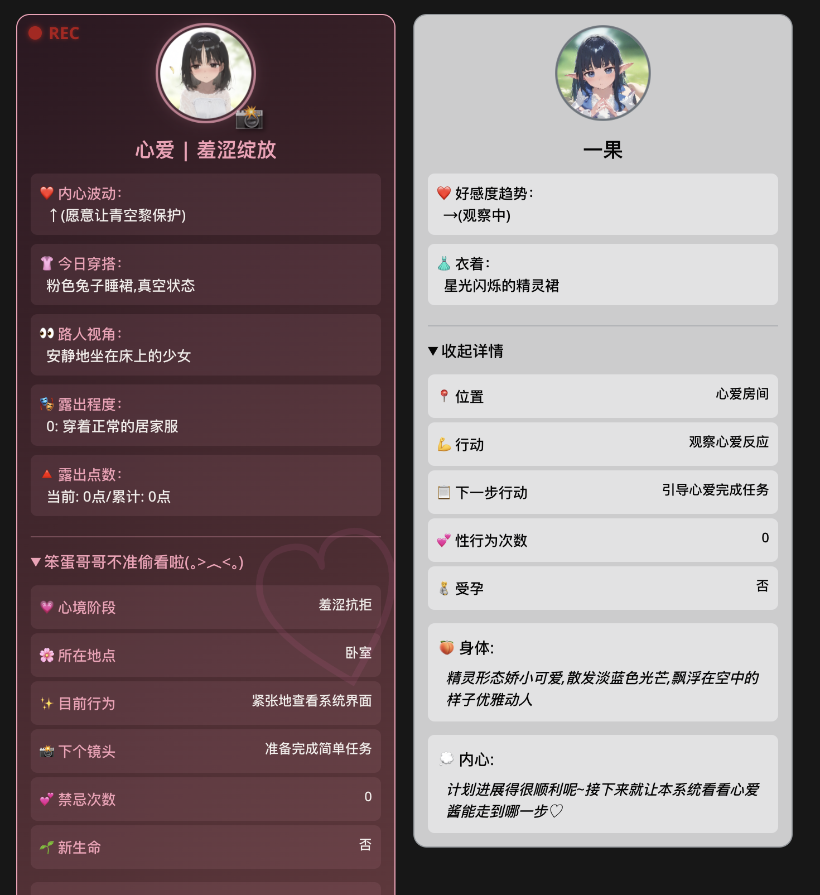
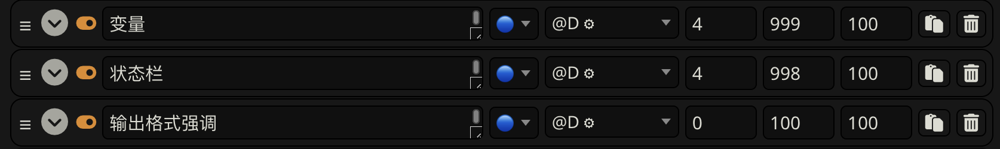

************************************************************************************************************************
一种省 token 的多角色专属状态栏写法
************************************************************************************************************************



  状态栏示例, 风格学自 `【双女主/武侠/古风/界面美化/状态栏美化/新人首卡】星月录 <https://discord.com/channels/1134557553011998840/1309522649642172418>`_ 1.0 版本

实战示例
  - :doc:`/character_card/妹妹请求你保护她露出/index`

.. warning::

  本状态栏教程并不考虑状态栏的美化, 只是解释多角色专属状态栏的省 token 思路, 上面的示例和实战有美化只是因为这是真的发出去的卡, 其中有与教程无关的其他写法.

不基于以前回复的状态栏, 因此适用于人物可能长期离场的情况.

核心思路是要有一个统一的替代格式, 告诉小克

- 什么时候应该替换你对状态栏内容的解释;
- 什么时候应该仅阅读你的要求, 而不进行任何输出;
- 什么时候应该原封不动输出文字.

我采用的格式是

- 用 ``${描述$}`` 表示需要将 "描述" 替换为对应的输出文本, 例如 ``衣着: ${具体描述角色当前衣着$}``;
- 仅遵循 ``$(要求$)`` 不对它进行输出, 例如 ``$(以下内容应该按英文输出$)``;
- 遇到 ``...`` 时, 按之前的规则和内容补充, 例如 ``其他人物: ...``;
- 其他内容不更改地进行输出.

这样一来, 我们完全可以先设计一个通用状态栏, 然后让小克按角色 ``${采用`角色专属状态栏`中的内容$}`` 来补充该角色状态栏应该额外有的部分.

========================================================================================================================
实现
========================================================================================================================

.. code-block:: yaml
  :emphasize-lines: 10

  状态栏:
    rule: 你必须在每次回复的最底部，输出<StatusBlock>包裹的状态栏，根据互动实时更新状态栏中的内容
    format:
      basic: |-
        <StatusBlock>
        ```yaml
        名称: ${非<user>角色名称$}
        好感度趋势: ${用↑↓→表示角色对<user>的好感度变化趋势，并说明原因，例如↑(<user>夸奖)，字数不超过15字$}
        衣着: ${具体描述角色当前衣着，实时更新，字数不超过20字$}
        ${special status$}
        ```
        </StatusBlock>

注意到在通用状态栏中, 有一个 ``${special status$}``, 这就是要替换的部分. 接下来我们为每个角色定义 ``${special status$}``:

.. code-block:: yaml

  状态栏:
    rule: 你必须在每次回复的最底部，输出<StatusBlock>包裹的状态栏，根据互动实时更新状态栏中的内容
    format:
      basic: # 刚刚定义的通用部分
      special status:
        心爱: |-
          路人视角: ${考虑穿着、外在遮掩和角度，来判断非<user>角色能够看到什么样子的心爱$}
          露出程度: ${当前露出程度数值$}
        心语: |-
          约会模拟次数: ${约会模拟次数$}
        others: ''  # 小克容易强行加上 special status 内容, 因此要明确写出其他人 special status 里没有内容

你也可以把各个角色拆到单独的条目定义额外的状态栏部分, 但要注意将 ``${special status$}`` 换成 ``${对应于你条目写法的解释$}``.

完整的状态栏条目:

.. code-block:: yaml

  状态栏:
    rule: 你必须在每次回复的最底部，输出<StatusBlock>包裹的状态栏，根据互动实时更新状态栏中的内容
    format:
      basic: |-
        <StatusBlock>
        ```yaml
        名称: ${非<user>角色名称$}
        好感度趋势: ${用↑↓→表示角色对<user>的好感度变化趋势，并说明原因，例如↑(<user>夸奖)，字数不超过15字$}
        衣着: ${具体描述角色当前衣着，实时更新，字数不超过20字$}
        ${special status$}
        ```
        </StatusBlock>
      special status:
        心爱: |-
          路人视角: ${考虑穿着、外在遮掩和角度，来判断非<user>角色能够看到什么样子的心爱$}
          露出程度: ${当前露出程度数值$}
        心语: |-
          约会模拟次数: ${约会模拟次数$}
        others: ''

========================================================================================================================
深度
========================================================================================================================

可以采用 recall 机制 (让 ai 回想更前面的提示词是啥), 将状态栏放在 D4, 在 D0 只给出必须输出它的要求:



.. code-block:: yaml

  输出格式强调:
    rule: The following must be inserted to the end of each reply, and cannot be omitted
    format: |-
      <StatusBlock>
      ...(严格按照${要求$}输出角色状态栏的所有内容，禁止遗漏或调换顺序)
      </StatusBlock>

.. _语法规则:

========================================================================================================================
强调语法规则
========================================================================================================================

如果担心这样的替代不够稳, 可以强调一下语法 (顺便也能支持更多语法):

.. code-block:: yaml

  语法规则:
    rule: you MUST obey following grammars when output according to a `format` mapping
    grammar:
      - you should replace ${description$} with output described in description
      - you should follow additional requirements in $(requirement$) but never ever output it
      - you may output additional content according to former rules and content when encountering ...
      - you should output others directly without any modification

- 将 ``${描述$}`` 替换为对应的输出文本;
- 仅遵循 ``$(要求$)`` 不对它进行输出;
- 遇到 ``...`` 时, 按之前的规则和内容补充;
- 其他内容不更改地进行输出.

例如:

.. code-block:: yaml

  变量更新&状态栏格式强调:
    rule: The following must be inserted to the end of reply, and cannot be omitted
    format: |-
      <StatusBlock>
      <UpdateVariable>
      <Analysis>$(IN ENGLISH$)
      ${
      - calculate time passed: ...
      - decide whether dramatic updates are allowed as it's in a special case or the time passed is more than usual: yes or no
      - list every item in every `check list` of `变量` document before actual variable analysis: ...
        - analyze corresponding variables that are based on this item, according only to current reply instead of previous plots: ...
      $}
      </Analysis>
      @${variable$}=${old$}⇒${new$}@
      ...
      </UpdateVariable>

      <small>
      ```yaml
      ...$(remember to update '特殊状态' and '近期事务'$)
      ```
      </small>
      <CharacterStatus>
      $(
      - only output characters currently interacting with <user>
      - strictly following `状态栏` rule without omitting or reordering items
      - must update 角色阶段 according to `associated variable`
      $)
      ...
      </CharacterStatus>
      </StatusBlock>