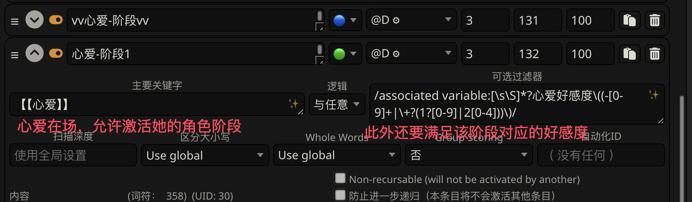
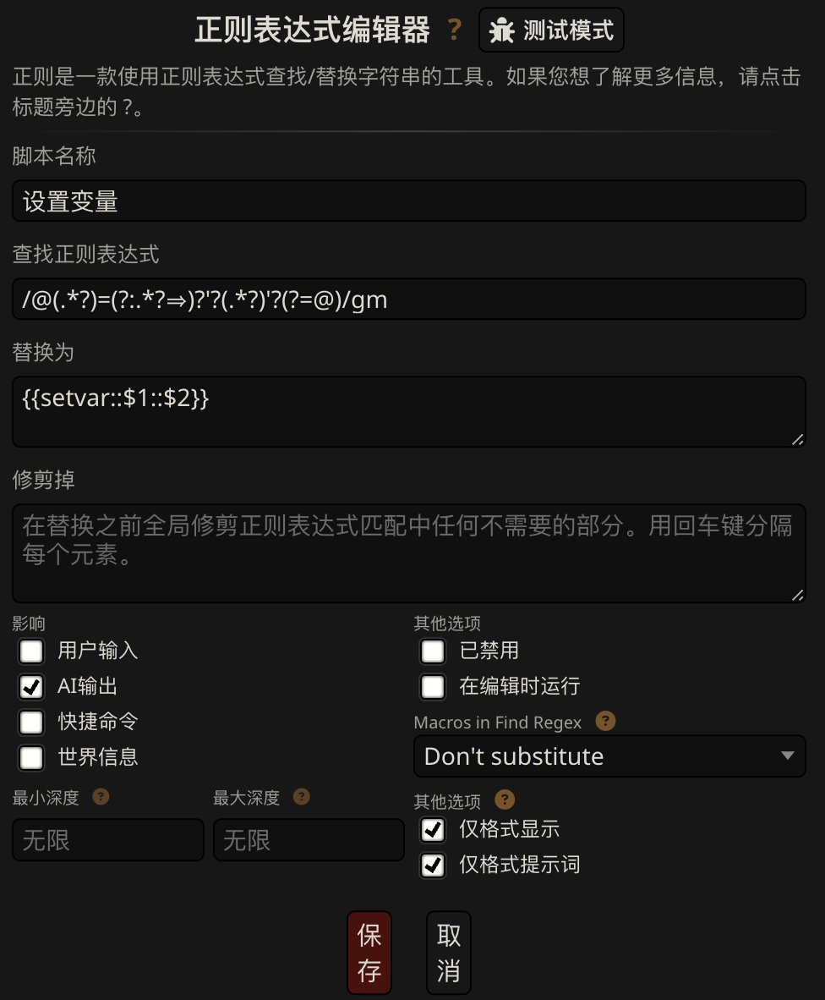
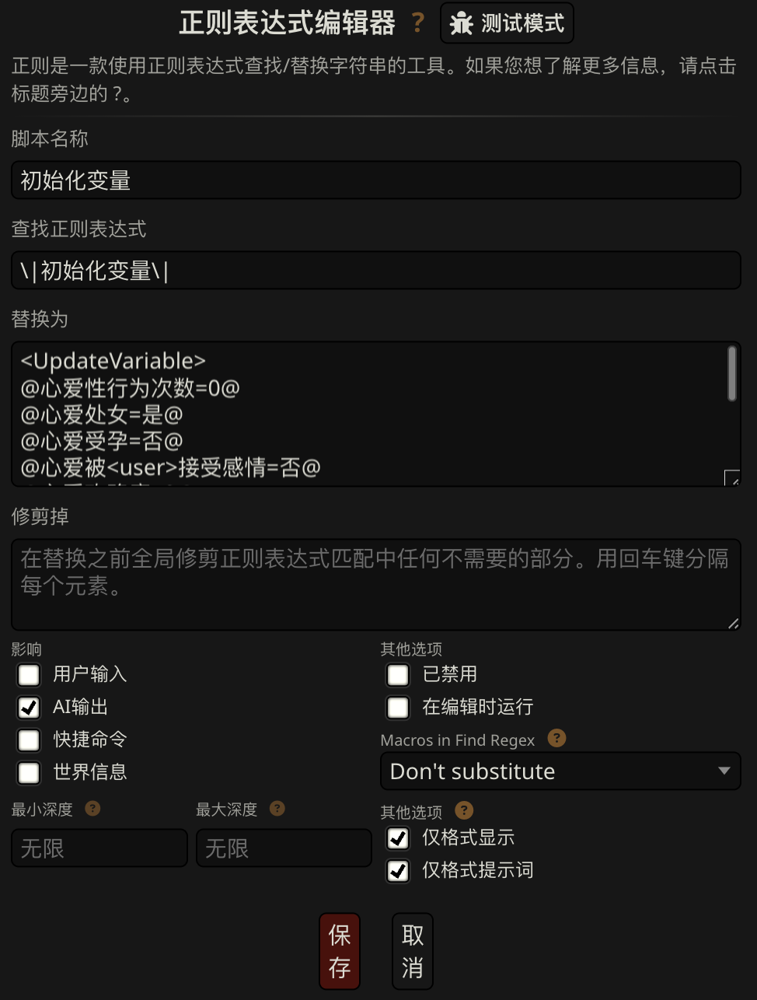
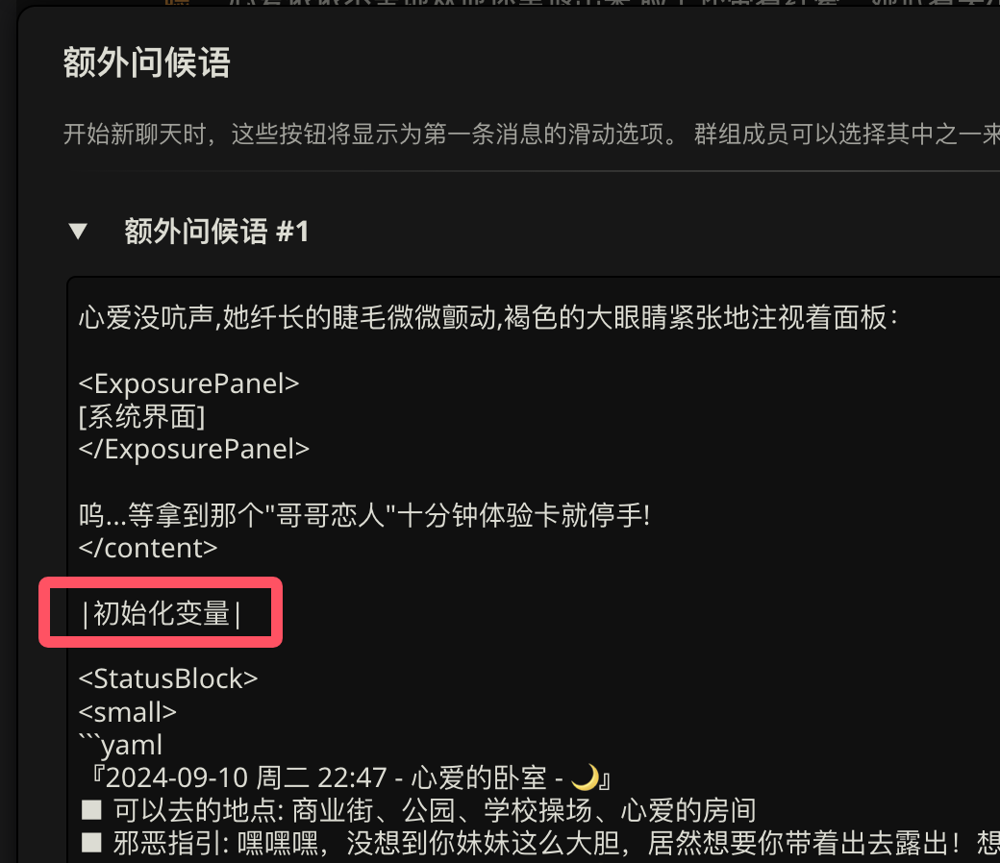

************************************************************************************************************************
复杂版 (想要为每个角色绑定不同的变量? 想要定义更多变量乃至用于某个系统? 想要为变量自定义更新规则?)
************************************************************************************************************************

本部分所有内容均以 :doc:`/character_card/妹妹请求你保护她露出/index` 为例, 它的角色信息由 :resource:`魔改自离、参考了离和 LULUZ 角色写法的预设 <预设/Lyean_designer_青空莉想做舞台少女的狗.json>` 辅助编写:

角色激活
  该条目放在定义之前, 关键字填写角色会被哪些文本激活, 内容填写 ``【【角色名】】``; 角色其他条目的关键字只写 ``【【角色名】】``.

  这样一来, 我们只需要管理角色激活条目, 就能设置某角色会如何被激活: 蓝灯? 绿灯? 有哪些关键字? 是否会被其他条目递归找到?

  .. figure:: 角色匹配方式解释.png

角色详情
  该条目放在定义之后, 绿灯且关键字为 ``【【角色名】】``.

角色关键信息
  该条目放在 D3, 绿灯且关键字为 ``【【角色名】】``, 其中要求 ai recall 角色详情.

角色阶段
  该条目放在 D3 或 D2, 绿灯且关键字为对应该阶段的正则匹配, 其中强调它的设定优先于关键信息和详情.

角色列表 [#1]_
  该条目放在 D2, 蓝灯, 内容是对每个角色的一两行介绍和可能的出场地点、方式, 从而在不激活角色各种条目的情况下也能允许 ai 让某角色自然出场. 此外, 它要求 ai recall 角色阶段.

  .. [#1] 学自 `超高自由度！XP大爆炸的魔法少女世界 <https://discord.com/channels/1134557553011998840/1265232579502542943>`_

角色出场规则提示
  该条目按角色卡需求放在 D2、D1 或 D0, 蓝灯, 内容是要求 ai 按角色列表中的出场方式在合适时候引入角色.

角色阶段的实现如下:

========================================================================================================================
列出变量
========================================================================================================================

角色卡中有两种变量:

常驻变量
  角色卡登场角色有心爱、心语、千枝子、一果, 她们有自己的性行为次数、受孕情况、处女情况、好感度.

  本角色卡支持角色在未提及的时候也正常出场 (具体见于 "角色列表" 和 "角色出场规则"). 如果我将这些变量设置为绿灯, 那么 ai 在角色出场时并不能知道她的这些变量, 因此我将这些变量放在常驻变量并设为蓝灯.

露出系统变量
  角色卡的主要故事是心爱有了露出系统, 可以做露出任务而兑换道具, 而一果是露出系统精灵. 我将露出系统的任务、商品也作为变量记录了下来并交给 ai 更新.

  由于露出任务与心爱高度绑定, 我将露出系统变量设为绿灯, 只由心爱和一果激活.

.. tabs::

  .. tab:: "变量" 条目内容

    .. code-block:: yaml

      # ^===变量开始===
      变量:
        availability: only use variables listed below, don't fabricate new variables
        name: consists of full path from root to leaf node that don't contain '变量', with no separators in between. For example, `心爱受孕` and `露出系统简单任务内容` are valid; `常驻变量心爱受孕`, `心爱.好感度` and `心爱` are invalid
        type: numerical, boolean (its value must be '是' or '否'), enumeration or string
      # ^常驻变量
      常驻变量:
        心爱:
          性行为次数: '{{getvar::心爱性行为次数}}'  # 发送给 ai 时, 这些 getvar 会被替换成对应的值
          处女: '{{getvar::心爱处女}}'
          受孕: '{{getvar::心爱受孕}}'
          被<user>接受感情: '{{getvar::心爱被<user>接受感情}}'
          好感度: '{{getvar::心爱好感度}}'
          露出点数: '{{getvar::心爱露出点数}}'
        心语:
          性行为次数: '{{getvar::心语性行为次数}}'
          处女: '{{getvar::心语处女}}'
          受孕: '{{getvar::心语受孕}}'
          被<user>接受感情: '{{getvar::心语被<user>接受感情}}'
          好感度: '{{getvar::心语好感度}}'
        # 千枝子、一果...
        check list:  # 这些变量对应的更新规则
          - Update variables suffixed with '次数' when a corresponding event occurs but don't update them any more during that event
          - Update variables suffixed with '好感度' according to characters' attitudes towards <user>'s behavior respectively only if they're currently aware of it $(±(3~6); but '好感度' must be capped in 0~100 and remains unchange when it's 100)
          - Switch variables suffixed with '处女', '受孕' or '被<user>接受感情' between '是' and '否'
          - Increase `心爱露出点数` only when an exposure task is fully completed, decrease it when exchanging goods
      # ^露出系统变量
      露出系统变量:
        露出系统:
          简单任务:
            内容: '{{getvar::露出系统简单任务内容}}'
            进度: '{{getvar::露出系统简单任务进度}}'
            奖励: '{{getvar::露出系统简单任务奖励}}'
          商品1:
            名称: '{{getvar::露出系统商品1名称}}'
            注释: '{{getvar::露出系统商品1注释}}'
            效果: '{{getvar::露出系统商品1效果}}'
            价格: '{{getvar::露出系统商品1价格}}'
          # ...
        check list:
          - Update variables prefixed with '露出系统' according to current reply's <ExposurePrompt> and plot
      # ^===变量结束===

  .. tab:: "变量" 酒馆设置

    .. figure:: 变量-酒馆.png

========================================================================================================================
设置与角色阶段绑定的变量
========================================================================================================================

在最开始的设计中, 我为她们各自绑定有不同的判定变量: 心爱累计露出点数、心语约会模拟次数、千枝子使用任意使用券次数、一果好感度. 虽然给的示例已经不再如此分别设计 (变量过于特殊, 多人场景难以同时推进角色阶段), 但依然保留了这样的结构:

.. tabs::

  .. tab:: "角色阶段" 条目内容

    .. code-block:: yaml

      # ^===角色阶段开始===
      角色阶段:
        descritpion: 角色阶段基于各角色的`角色关键信息`和`角色详情`词条，描述了经过剧情发展后角色成长得到的新人设
        associated variable: 各角色的阶段关联有不同的变量，仅用于判断其角色阶段是否应该发生变化，不影响阶段的具体人设
        行为指导: 角色在这个阶段会采取的行为
        变化倾向: 随着associated variable接近下一阶段，角色逐渐发生的变化
      # ^vv心爱-阶段vv
      心爱:
        associated variable: 心爱好感度({{getvar::心爱好感度}})  # <-- 要绑定的变量
        stage name:
          阶段1: 羞涩抗拒(24以下)  # <-- 阶段名和对应的变量范围
          阶段2: 欲拒还迎(25~49)
          阶段3: 共犯默契(50~74)
          阶段4: 沉沦释放(75~99)
          阶段5: 灵肉相许(100以上)
        # ^心爱-阶段1
        羞涩抗拒:
          行为指导:
            - 只接受简单难度的露出任务，每次都需要哥哥的鼓励才敢尝试
            - 露出时总是躲在哥哥身后，却又嘴硬说不需要保护
            - 独处时会对着镜子练习表情管理，试图掩饰对哥哥的依赖
            - 开始研究系统商店，却在看到哥哥相关的商品时快速翻过
            - 偷偷搜集大胆的cos服，但只敢在深夜独自试穿
            - 对千枝子保持警惕，认为她是潜在的情敌
          变化倾向:
            - 渐渐意识到露出点数的实用价值，开始主动寻找完成简单任务的机会
            - 在拍摄时尝试更富表现力的构图，但仍避免自己入镜
            - 开始用相机记录自己的露出过程，却从不让任何人看到
            - 完成任务后会反复回味哥哥的反应，暗自期待下一次相遇
            - 回避心语的好奇询问，转而反问她男友的事情
        # ^心爱-阶段2
        # ...
        # ^心爱-阶段3
        # ...
        # ^心爱-阶段4
        # ...
        # ^心爱-阶段max
        # ...
      # ^===角色阶段结束===
      rule:
        - 角色阶段描述的是角色成长得到的当前人设，因此角色阶段中的要求必须优先于作为背景的`角色关键信息`和`角色详情`
        - 角色与<user>互动时会在保持人设的同时，倾向于采取与变动associated variable相关的行动

  .. tab:: "角色阶段" 酒馆设置

    .. figure:: 角色阶段-酒馆.png

========================================================================================================================
编写各阶段对应的匹配正则
========================================================================================================================

我们需要 **匹配角色的当前阶段**, 而不匹配角色的其他阶段, 这一般是通过正则关键字匹配对应数值来完成的.

由上可知, 我们要么可以匹配 "变量" 条目中的变量, 要么可以匹配 "角色阶段" 中绑定的变量. 在匹配时, 需要考虑 ``{{getvar::变量}}`` 已经被替换为对应的数值.

要验证匹配结果, 请使用 `regex101 <https://regex101.com/>`_.

------------------------------------------------------------------------------------------------------------------------
匹配 "变量" 条目中的变量
------------------------------------------------------------------------------------------------------------------------

实例见于示例角色卡的 "剧透-限制" 和 "剧透-解放" 条目.

.. tabs::

  .. tab:: 原文本

    .. code-block:: yaml

      # ^常驻变量
      常驻变量:
        心爱:
          性行为次数: '0'  # 匹配时已经被替换为对应的数值
          处女: '是'
          受孕: '否'
          被<user>接受感情: '否'
          好感度: '0'
          露出点数: '0'
        心语:
          性行为次数: '0'
          处女: '是'
          受孕: '否'
          被<user>接受感情: '否'
          好感度: '0'

  .. tab:: 酒馆中

    .. code-block:: yaml

      常驻变量: {心爱: {性行为次数: '0', 处女: '是', 受孕: '否', 被<user>接受感情: '否', 好感度: '0', 露出点数: '0'}, 心语: {性行为次数: '0', 处女: '是', 受孕: '否', 被<user>接受感情: '否', 好感度: '0'}}

假设我们要匹配心爱好感度为 24 以下的情况, 则匹配正则是:

.. code-block:: text

  /心爱:([\s\S](?<!好感度))*?好感度:\s*'(-[0-9]+|\+?(1?[0-9]|2[0-4]))'/

其中,

- ``好感度``: 对于要匹配的具体变量, 按上面正则里那样填两次.
- ``[0-9]``: 匹配一个 0~9.
- ``[0-9]+``: 匹配一个以上的 0~9.
- ``-[0-9]+``: 匹配任意负数, 我的设计里没对好感度的范围进行限制, 它可能是负数.
- ``\+?``: 匹配一个或零个 ``+``, 这是为了避免猪鼻 ai 更新时加一个加号.
- ``1?``: 匹配一个或零个 ``1``.
- ``1?[0-9]``: 0~19
- ``\+?(1?[0-9]|2[0-4])``: 0~24, 并且可能前面有加号
- ``(-[0-9]+|\+?(1?[0-9]|2[0-4])``: 24 以下

假设我们要匹配心爱好感度为 100 以上的情况, 则匹配正则是:

.. code-block:: text

  /心爱:([\s\S](?<!好感度))*?好感度:\s*'\+?[0-9]{3,}'/

其中,

- ``[0-9]{3,}``: 匹配三个以上的 0~9. (另外, ``{min, max}`` 可用于匹配 min~max 个.)

.. hint::

  如果使用 ``/正则/s``, 则 ``.`` 也可以查找换行符, 我们可以用 ``.`` 代替 ``[\s\S]``. 因而正则可以写为 ``/心爱:(.(?<!好感度))*?好感度:\s*'\+?[0-9]{3,}/s``

.. admonition:: 别看: 错误写法和具体的正则解释
  :class: dropdown, dontread

  一种错误的写法是:

  .. code-block:: text

    /心爱:[\s\S]*?好感度:\s*'(-[0-9]+|\+?(1?[0-9]|2[0-4]))'/

  其中,

  - ``\s``: 匹配一个空白字符 (空格、换行等).
  - ``\s*``: 匹配任意数量的空白字符, 在整个正则满足的情况下匹配到的越多越好.
  - ``[\s\S]``: 匹配一个空白字符或非空白字符, 即匹配一个任意字符.
  - ``[\s\S]*?``: 匹配任意数量的任意字符, 在整个正则满足的情况下匹配到的越少越好.

  乍一看这个正则并没有问题, 它匹配了心爱, 又匹配了最近一个在 24 以下的好感度 (``[\s\S]*?``). 但是, 假如心爱的好感度没有在 24 以下, 而心语的好感度恰好在呢?

  .. code-block:: yaml
    :emphasize-lines: 8, 15

    # ^常驻变量
    常驻变量:
      心爱:
        性行为次数: '0'
        处女: '是'
        受孕: '否'
        被<user>接受感情: '否'
        好感度: '26'  # 不在 24 以下
        露出点数: '0'
      心语:
        性行为次数: '0'
        处女: '是'
        受孕: '否'
        被<user>接受感情: '否'
        好感度: '0'  # 最近一个在 24 以下的好感度!

  因此, 我们必须要求正则仅能尝试匹配第一个好感度:

  .. code-block:: text

    /心爱:([\s\S](?<!好感度))*?好感度:\s*'(-[0-9]+|\+?(1?[0-9]|2[0-4]))'/

  其中,

  - ``([\s\S](?<!好感度))*?``: 匹配遇到 "好感度" 之前的任意字符

------------------------------------------------------------------------------------------------------------------------
匹配 "角色阶段" 条目中绑定的变量
------------------------------------------------------------------------------------------------------------------------

实例见于示例角色卡的各 "角色-阶段" 条目.

.. tabs::

  .. tab:: 原文本

    .. code-block:: yaml

      # ^vv心爱-阶段vv
      心爱:
        associated variable: 心爱好感度(0)
        stage name:
          阶段1: 羞涩抗拒(24以下)
          阶段2: 欲拒还迎(25~49)
          阶段3: 共犯默契(50~74)
          阶段4: 沉沦释放(75~99)
          阶段5: 灵肉相许(100以上)

  .. tab:: 酒馆中

    .. code-block:: yaml

      心爱: {associated variable: '心爱好感度(0)', stage name: {阶段1: 羞涩抗拒(24以下), 阶段2: 欲拒还迎(25~49), 阶段3: 共犯默契(50~74), 阶段4: 沉沦释放(75~99), 阶段5: 灵肉相许(100以上)}

假设我们要匹配心爱好感度为 24 以下的情况, 则匹配正则是:

.. code-block:: text

  /associated variable:[\s\S]*?心爱好感度\((-[0-9]+|\+?(1?[0-9]|2[0-4]))\)/

假设我们要匹配心爱好感度为 100 以上的情况, 则匹配正则是:

.. code-block:: text

  /associated variable:[\s\S]*?心爱好感度\(\+?[0-9]{3,}\)/

========================================================================================================================
匹配各阶段
========================================================================================================================

有了匹配正则, 我们来实际填写条目关键字. 自然地, 这些条目应该设置为绿灯, 然后,

1. 我们用 ``【【角色名】】`` 允许它们被激活;
2. 我们用之前写好的正则匹配某个阶段.

这是通过 "与任意" 可选过滤器办到的: 只有 **【【角色名】】** 和 **角色阶段对应的正则** 都匹配上时, 才激活心爱对应的角色阶段.



.. admonition:: 可选过滤器
  :class: note

  如果可选过滤器中填写有内容, 则除了左边的 "主要关键字" 以外, 还要按照选定的 "逻辑", 满足右边的 "可选过滤器":

  - 与任意 (and any): 右边任意匹配到才触发条目, 也就是这里的 ``【【心爱】】`` 和心爱角色阶段对应的正则匹配都匹配上.
  - 与所有 (and any): 右边所有匹配到才触发条目, 见于示例角色卡的 "剧透-限制" 条目.
  - 非所有 (not all): 右边有没匹配到的才触发条目, **不要用!**
  - 非任意 (not any): 右边都没匹配到才触发条目, **不要用!**

  **不要使用非所有和非任意**, 它的设计存在问题: 如果右边的 "可选过滤器" 还没满足时已经先成功匹配到左边的 "主要关键字", 那么这个条目就会被激活; 此后, 即使右边的 "可选过滤器" 被满足, 这个条目也不会取消激活. **这甚至不是 bug**, 按 `官方解释 <https://github.com/SillyTavern/SillyTavern/issues/2213>`_ 这就是故意的.

========================================================================================================================
让 ai 输出更新
========================================================================================================================

我们需要告诉 ai 如何输出更新, 这一步我因为要需要支持蓝灯的 "常驻变量" 和绿灯的 "露出系统变量" 而进行了拆分.

在 D4 的 "变量" 条目中, 我分别描述了变量的更新规则:

.. code-block:: yaml

  # ^常驻变量
  常驻变量:
    # ...
    check list:  # 这些变量对应的更新规则
      - Update variables suffixed with '次数' when a corresponding event occurs but don't update them any more during that event
      - Update variables suffixed with '好感度' according to characters' attitudes towards <user>'s behavior respectively only if they're currently aware of it $(±(3~6); but '好感度' must be capped in 0~100 and remains unchange when it's 100)
      - Switch variables suffixed with '处女', '受孕' or '被<user>接受感情' between '是' and '否'
      - Increase `心爱露出点数` only when an exposure task is fully completed, decrease it when exchanging goods
  # ^露出系统变量
  露出系统变量:
    # ...
    check list:
      - Update variables prefixed with '露出系统' according to current reply's <ExposurePrompt> and plot
  # ^===变量结束===

在 D0 的 "变量更新&状态栏格式强调" 条目中, 我要求 ai 在状态栏之前按照描述的规则分析变量并进行更新 (类似于离的状态栏 COT): (描述格式见于 :ref:`语法规则`, 变种见于 :ref:`变量更新规则的其他写法`)

.. tabs::

  .. tab:: 拆开解释

    整个更新被包裹在 ``<UpdateVariable>`` 中, 放在 <StatusBlock> 最上方

    .. code-block:: text

      <StatusBlock>
      <UpdateVariable>
      <Analysis>
      具体分析...
      </Analysis>
      更新变量...
      </UpdateVariable>

      状态栏其他部分...
      </StatusBlock>

    其中 ``<Analysis>`` 对变量更新进行分析,

    .. code-block:: text

      <Analysis>$(IN ENGLISH$)
      ${
      # 计算经过的时间
      - calculate time passed: ...

      # 判断当前剧情是否有特殊事件或比较大的时间跨度, 如果有则允许戏剧性的更新 (如好感度从 100 降为 0)
      - decide whether dramatic updates are allowed as it's in a special case or the time passed is more than usual: yes or no

      # 调取所有 check list 中的每一条更新规则
      - list every item in every `check list` of `变量` document before actual variable analysis: ...

        # 对该条更新规则对应的变量分别进行分析, 分析时仅依据当前剧情而不考虑以前的情节 (避免重复更新, 因为 ai 不知道以前更新过)
        - analyze corresponding variables that are based on this item, according only to current reply instead of previous plots: ...
      $}
      </Analysis>

    然后我们让 ai 对变量输出更新语句, 之后我们正则匹配该语句从而更新变量

    .. code-block:: text

      <UpdateVariable>
      <Analysis>
      具体分析...
      </Analysis>
      # 经验表明最好有一个 ${old$} 而不是 @${variable$}=${new$}@, 这样 ai 更愿意更新变量
      @${variable$}=${old$}⇒${new$}@
      ...
      </UpdateVariable>

  .. tab:: 整个条目

    .. code-block:: yaml

      输出格式强调:
        rule: The following must be inserted to the end of reply, and cannot be omitted
        format: |-
          <StatusBlock>
          <UpdateVariable>
          <Analysis>$(IN ENGLISH$)
          ${
          - calculate time passed: ...
          - decide whether dramatic updates are allowed as it's in a special case or the time passed is more than usual: yes or no
          - analyze every variable based on its `check list`, according only to current reply instead of previous plots: ...
          $}
          </Analysis>
          @${variable$}=${old$}⇒${new$}@
          ...
          </UpdateVariable>

          <small>
          ```yaml
          ...$(remember to update '特殊状态' and '近期事务'$)
          ```
          </small>
          <CharacterStatus>
          ...$(only output characters currently interacting with <user>; strictly following `状态栏` rule without omitting or reordering items; must update 角色阶段 according to `associated variable`$)
          </CharacterStatus>
          </StatusBlock>

========================================================================================================================
利用输出更新变量
========================================================================================================================

有了 ai 的输出, 我们可以更新变量. 为此需要用 "设置变量" 正则将输出匹配成对应的 ``{{setvar::变量::新的变量值}}``. 这个正则在最上面示例角色卡的局部正则中给出.

.. code-block:: text

  /@(.*?)=(?:.*?⇒)?'?(.*?)'?(?=@)/gm



此外, 我们还需要向玩家、ai 隐藏更新规则, 这部分正则请见于示例角色卡的局部正则.

.. note::

  有的时候 ai 不会输出 ``</UpdateVariable>``, 进而导致变量更新部分没能被正确隐藏, 这部分的一个弥补方案请参考: https://discord.com/channels/1134557553011998840/1291999036353810442/1313916982118056037, 示例角色卡在 "隐藏变量更新" 正则中采用了这样的方案

========================================================================================================================
设置好感度初始值
========================================================================================================================

为了让聊天能正常开始, 我们需要在 **每一个开局** 中设置 **所有变量**.

为此, 我们创建一个 "初始化变量" 正则放在 "设置变量" 正则上方, 用它将 ``|初始化变量|`` 替换成对应的 ``@变量=值@``:



然后, 在 **每一个开局** 中写 ``|初始化变量|``:



这样写一个 "初始化变量" 正则而不是直接在开局写一堆 ``@变量=值@`` 有一个好处: 如果后续角色卡更新时设置了新的变量, 则玩家更新角色卡后由于正则得到更新, 新的变量自然得到设置—— **玩家仍然能游玩原来的聊天文件**.

========================================================================================================================
附录: 关于变量显示的考虑
========================================================================================================================

以上所有内容都建立在一个基础上: 酒馆和 ai 除了变量条目、角色阶段条目内, 不能从其他任何地方——特别是 ai 回复中——知道变量的值; 也就是说酒馆和 ai 仅知道最新的变量值.

如果你需要在 ai 回复中显示这些变量的值, 那么有两种处理方法.

------------------------------------------------------------------------------------------------------------------------
方法1: 酒馆和 ai 不知道, 但是玩家能看到
------------------------------------------------------------------------------------------------------------------------

我们不再让 ai 输出具体的内容, 而是以正则替代的方式将实际的内容显示给玩家.

例如, 示例角色卡对于露出系统界面仅要求 ai 输出:

.. code-block:: text

  <ExposurePrompt>
  [系统界面]
  </ExposurePrompt>

而 "露出系统面板" 正则将它替换为具体的界面.

这样酒馆或 ai 不会从正文看到界面具体内容, 但是玩家能看到, **而且由于输出很少很快就能看到整个内容**.

------------------------------------------------------------------------------------------------------------------------
方法2: 知道就知道吧, 我无所谓, 甚至还想把以前的变量更新情况告诉 ai
------------------------------------------------------------------------------------------------------------------------

如果要这样处理, 那么你应该:

- 将变量条目设置在 D1 或 D0. 由于 ai 能看到以前 ai 回复中的变量值, 如果变量条目中存储的最新变量值还放在 D4 (上上次 ai 回复之前), 那么它只能认为上一次 ai 回复时的值才是最新值.
- 对角色各阶段进行正则匹配时考虑扫描深度或仅允许递归激活 (Delay until recursion). 由于酒馆能看到以前 ai 回复中的变量值, 早期阶段可能会被正则匹配到并被激活.

.. _变量更新规则的其他写法:

========================================================================================================================
附录: 变量更新规则的其他写法
========================================================================================================================

.. warning::

  显然我没办法保持这里的内容为最新角色卡中使用的方案, 更没办法涵盖全部情况. 请发挥你的创造力.

------------------------------------------------------------------------------------------------------------------------
轻量型 (ai 自己搞定型)
------------------------------------------------------------------------------------------------------------------------

你不需要为变量更新写任何 ``check list`` 规则, 而是直接在 "变量更新&状态栏格式强调" 让 ai 自己搞定:

.. code-block:: text

  <UpdateVariable>
  <Analysis>$(IN ENGLISH)
  ${
  - calculate time passed: ...
  - decide whether dramatic updates are allowed as it's in a special case or the time passed is more than usual: yes or no
  - what variables should be updated, accoring only to current reply instead of previous plots: ...
  $}
  </Analysis>
  @${variable$}=${old$}⇒${new$}@ (reason)
  ...
  </UpdateVariable>

------------------------------------------------------------------------------------------------------------------------
我没多少变量型
------------------------------------------------------------------------------------------------------------------------

正文采用的方案考虑了 "常驻变量" 的蓝灯和 "露出系统变量" 的绿灯, 因而将 ``check list`` 分别放置在各自的条目中, 再在 "变量更新&状态栏格式强调" 中要求列举这些变量. 也许你只是想要分析一两种变量, 则可以将它们的规则直接列举在 "变量更新&状态栏格式强调" 中:

.. code-block:: text

  <UpdateVariable>
  <Analysis>$(IN ENGLISH$)
  ${
  - calculate time passed: ...
  - decide whether dramatic updates are allowed as it's in a special case or the time passed is more than usual: yes or no
  - update variables suffixed with '次数' when a corresponding event occurs but don't update them any more during that event: ...
  - Update variables suffixed with '好感度' according to characters' attitudes towards <user>'s behavior respectively only if they're currently aware of it $(±(3~6); but '好感度' must be capped in 0~100 and remains unchange when it's 100): ...
  - switch variables suffixed with '处女', '受孕' or '被<user>接受感情' between '是' and '否': ...
  $}
  </Analysis>
  @${variable$}=${old$}⇒${new$}@
  ...
  </UpdateVariable>

------------------------------------------------------------------------------------------------------------------------
依次检查型
------------------------------------------------------------------------------------------------------------------------

正文采用的方案仅要求 ai 根据 ``check list`` 分析变量而不要求输出 ``check list``, 因而 ai 可能遗漏对 ``check list`` 的考虑. 你可以在 D0 要求对 ``check list`` 进行列举:

.. code-block:: text

  <UpdateVariable>
  <Analysis>$(IN ENGLISH$)
  ${
  - calculate time passed: ...
  - decide whether dramatic updates are allowed as it's in a special case or the time passed is more than usual: yes or no
  - list every item in every `check list` of `变量` document before actual variable analysis: ...
    - analyze corresponding variables that are based on this item, according only to current reply instead of previous plots: ...
  $}
  </Analysis>
  @${variable$}=${old$}⇒${new$}@
  ...
  </UpdateVariable>

------------------------------------------------------------------------------------------------------------------------
周全列举型
------------------------------------------------------------------------------------------------------------------------

由于依次检查型的 ``check list`` 并没有直接列在 D0, ai 偶尔会漏掉某些 ``check list`` 规则. 你可以将列举 ``check list`` 规则和分析变量更新给拆开, 从而保证它列举这些规则:

.. code-block:: text

  <UpdateVariable>
  ${display every `check list` in `变量` document before actual variable analysis$}
  <Analysis>$(IN ENGLISH$)
  ${
  - calculate time passed: ...
  - decide whether dramatic updates are allowed as it's in a special case or the time passed is more than usual: yes or no
  - analyze variables based on `check list` according only to current reply instead of previous plots: ...
  $}
  </Analysis>
  @${variable$}=${old$}⇒${new$}@
  ...
  </UpdateVariable>