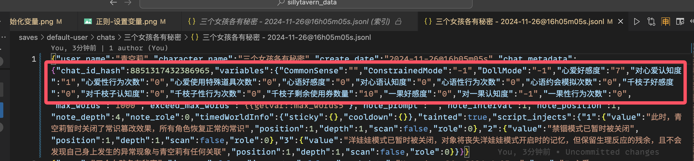
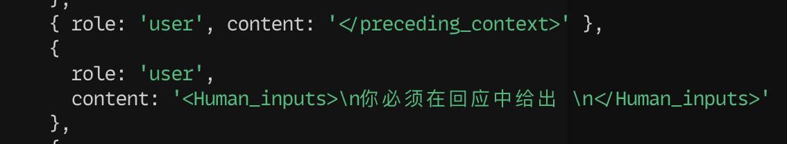
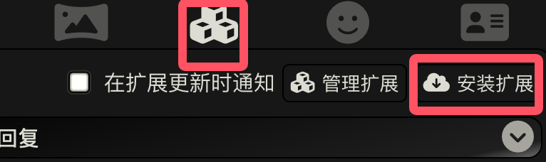
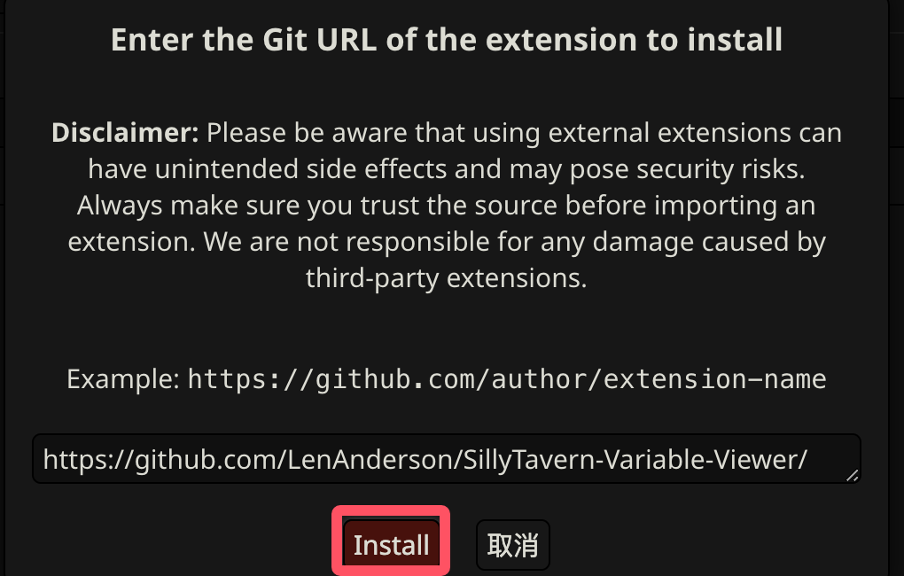
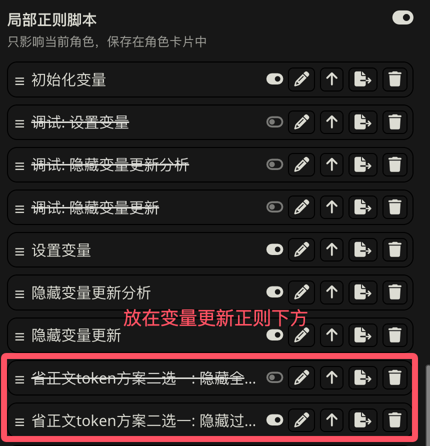

########################################################################################################################
角色阶段: 精确记录最新数值、为不同角色绑定不同变量、为每个阶段显示特殊名称
########################################################################################################################

精确记录最新数值
  采用聊天变量记录数值, 并相比于 QuickReply 容易出错, 这种方式能够保证删除楼层或重 roll 后变量依旧正确.

为不同角色绑定不同变量 (仅复杂版实现)
  某个角色应该用好感度, 另一个角色却要用堕落度? 某个角色的数值跨度是每增加 10 点更新一个阶段, 另一个却是每减少 1 点更新一个阶段? 没问题.

为每个阶段显示特殊名称 (仅复杂版实现)
  总是在状态栏显示数值太无聊了? 让 ai 自觉地更新角色阶段名称吧: 羞涩抗拒(0~24)-欲拒还迎(25~49)-共犯默契(50~74)-沉沦释放(75~99)-灵肉相许(100以上).

.. note::

  以下内容默认依赖于递归扫描 (一个条目被发送的文本激活后, 条目中的文本会激活更多条目), 因此我有一个 "角色-激活" 列表; 不担心递归导致 token 爆炸则不需要这样考虑.

========================================================================================================================
原理
========================================================================================================================

通过发送 ``{{setvar::心爱好感度::0}}``, 我们可以在当前聊天中设置一个变量 ``心爱好感度``, 之后发送 ``{{getvar::心爱好感度}}`` 即能得到对应的值. 这样的变量是在当前聊天中有效的, 被记录在聊天文件的开头.

因此, 我们只需要让 ai 能够更新这个变量, 并用这个变量进行正则匹配, 即可得到精确的结果.

但我们很难直接要求 ai 回复 ``{{setvar::变量名::更新的值}}``, 因为我们无论通过输入还是世界书, 向 ai 发送这个要求时, 这部分都会被替代为一次变量设置.

  发送给 ai ``你必须在回应中给出 {{setvar::心爱好感度::新的值}}`` 时实际发送的内容

所以我们需要要求 ai 回应一种特定格式来表示变量更新, 并通过正则匹配, 将它输出的特定格式替换为 ``{{setvar::变量名::更新的值}}``. 我采用的格式如下:

.. code-block:: text

  @${变量名$}=${旧值$}→${新值$}@

========================================================================================================================
实现
========================================================================================================================

文本中所有的 ``# 注释`` 都是本教程的注释, 并不是条目实际内容.

我写角色卡是在 VSCode 中编写条目, 再使用 :doc:`脚本 </tool_and_experience/lorebook_script/index>` 将它同步到酒馆中. 在这个过程中脚本会对内容进行压缩, 因而酒馆里的世界书比较难读. 因此, **看示例角色卡时别忘了下载它的世界书源文件**.

.. toctree::
  :maxdepth: 1

  simple/index
  complex/index

========================================================================================================================
调试方法
========================================================================================================================

------------------------------------------------------------------------------------------------------------------------
安装 SillyTavern Variable Viewer 插件
------------------------------------------------------------------------------------------------------------------------

安装 ``https://github.com/LenAnderson/SillyTavern-Variable-Viewer/`` 插件, 方法见图:

然后, 你可以在聊天框输入 ``/variableviewer`` 来开关变量查看器.

------------------------------------------------------------------------------------------------------------------------
查看变量变化情况
------------------------------------------------------------------------------------------------------------------------

如果要在每次 ai 输出时能直接查看变量的更新情况, 可以用示例角色卡中的 "调试: 设置变量"、"调试: 隐藏变量更新分析" 和 "调试: 隐藏变量更新" 正则.

------------------------------------------------------------------------------------------------------------------------
确认变量是否更新
------------------------------------------------------------------------------------------------------------------------

.. warning::

  这样的查看方式存在延迟, "设置变量" 正则同时启用了 "仅格式显示" 和 "仅格式提示词", 变量除了因为 "仅格式显示" 在刷新网页、加载聊天等更新外, 还会在发送消息时更新.

^^^^^^^^^^^^^^^^^^^^^^^^^^^^^^^^^^^^^^^^^^^^^^^^^^^^^^^^^^^^^^^^^^^^^^^^^^^^^^^^^^^^^^^^^^^^^^^^^^^^^^^^^^^^^^^^^^^^^^^^
通过酒馆
^^^^^^^^^^^^^^^^^^^^^^^^^^^^^^^^^^^^^^^^^^^^^^^^^^^^^^^^^^^^^^^^^^^^^^^^^^^^^^^^^^^^^^^^^^^^^^^^^^^^^^^^^^^^^^^^^^^^^^^^

你可以在聊天区任意位置或者发送 ``{{getvar::变量::值}}`` 来获取最新的变量值, 也可以发送 ``/echo {{getvar::变量::值}}`` 等来得知.

^^^^^^^^^^^^^^^^^^^^^^^^^^^^^^^^^^^^^^^^^^^^^^^^^^^^^^^^^^^^^^^^^^^^^^^^^^^^^^^^^^^^^^^^^^^^^^^^^^^^^^^^^^^^^^^^^^^^^^^^
通过聊天文件
^^^^^^^^^^^^^^^^^^^^^^^^^^^^^^^^^^^^^^^^^^^^^^^^^^^^^^^^^^^^^^^^^^^^^^^^^^^^^^^^^^^^^^^^^^^^^^^^^^^^^^^^^^^^^^^^^^^^^^^^

变量被记录在聊天文件开头, 你可以导出聊天文件或去存档 (一般在 ``SillyTavern/default-user/chats/角色卡名称/聊天文件``, 更推荐这种, 用 VSCode 打开能看见变量实时更新) 来获取聊天文件, 然后用记事本、VSCode 等查看聊天文件开头

========================================================================================================================
与摘要/总结的冲突问题
========================================================================================================================

有的玩家喜欢设置摘要/总结去掉正文省token, 这样很容易导致以前的更新消失, 为此要让他们将初始化变量、更新变量的正则放在摘要正则的上面. 最简单的方法是在局部正则 **底部** 里放一个摘要正则 **在初始化变量、更新变量正则的下方**, 要求他们用这个.

例如, 实现的示例角色卡中提供了这样的摘要/总结正则, 效果是 **如果有摘要/总结** 则隐藏除了摘要/总结以外所有文本:

.. code-block:: text

  /([\s\S]*?
\s*
\s*(摘要|总结)?\s*<\/summary>|<\/details>[\s\S]*?$)/gs

只要初始化变量、更新变量的正则在这个正则上方, 就不会有任何问题.

========================================================================================================================
与 ``{{user}}`` 的冲突问题
========================================================================================================================

酒馆不支持嵌套宏, 因此不要用 ``{{user}}`` 作为变量名, 而应该用 ``<user>``.

不支持嵌套宏体现在哪呢? ``{{setvar::变量::值}}`` 和 ``{{user}}`` 都是宏, 但 ``{{setvar::被{{user}}接受感情::否}}`` 会被视为 ``{{setvar::被{{user}}`` 和 ``接受感情::否}}``, 而不是先替代内层的 ``{{user}}``, 再替代外层的 ``{{setvar::变量::值}}``.

========================================================================================================================
与酒馆仅加载前 n 条消息的兼容性
========================================================================================================================

如果玩家在酒馆中设置了 "仅加载前 n 条消息", 则他在上滑手动加载以前消息时, 变量将会因旧聊天消息的加载而更新成旧值.

**这一般不会有问题**: "设置变量" 正则同时启用了 "仅格式显示" 和 "仅格式提示词", 变量除了因为 "仅格式显示" 在刷新网页、加载聊天等更新外, 还会在发送消息时更新.

但是, 被 ``/hide`` 隐藏的消息中的变量更新能通过 "仅格式显示" 被正确设置, 而不能通过 "仅格式提示词" 来得到设置. 这就导致了两种特殊情况, 但我认为一般不会有玩家这么处理消息, 哪怕总结姬也很难导致这种特殊情况发生:

.. code-block:: text
  :caption: 旧消息中的变量值被通过正则等间接手段修改, 而消息刚好被隐藏

  0 (hide): @心爱性行为次数=0@ 被改为 @心爱性行为次数=10@
  ...中间心爱性行为次数不变...
  ===以上消息都没被加载, 只会通过 "仅格式提示词" 设置===
  ...中间心爱性行为次数不变...
  400: 发送消息时, 心爱性行为次数会使用原来游玩时设置的 0 而非 10, 因为 "仅格式提示词" 不能处理隐藏消息

.. code-block:: text
  :caption: 中间的消息被隐藏, 因而变量被设置成旧值

  0: @心爱好感度=10@
  1 (hide): @心爱好感度=20@
  2: 发送消息时, 心爱好感度会从 "仅格式显示" 设置的 20 变成 "仅格式提示词" 设置的 10

========================================================================================================================
前端助手: 本方法的完美补充
========================================================================================================================

如果你会或者能让 ai 帮你写 JavaScript/TypeScript, 你完全可以采用 `前端助手 <https://discord.com/channels/1134557553011998840/1296494001406345318>`_ 来补充这个方案: 编写一个全局脚本在每次接收到 ai 消息时将所有变量的当前值都加入到该楼层中.

这样一来, 由于所有变量值都在最新楼层:

- 你不再需要考虑与总结/摘要正则的冲突问题, 玩家拿到角色卡装了插件直接就能玩.
- 能完美兼容酒馆仅加载前 n 条消息的情况, 对 ``/hide`` 消息进行处理.

具体教程待补充.

此外, 你完全可以在用前端助手扩展更多内容:

- 相比于这里仅用正则替换 ``{{setvar::变量::值}}`` 会灵活更多.
- 同样不需要过多折腾 QuickReply 的恶心语法 (ai 能帮你写 JavaScript/TypeScript, 但不能帮你写 QuickReply), 但包含 QuickReply 全部功能.

========================================================================================================================
用变量条件判断
========================================================================================================================

**不要将复杂条件交给小克判断, 小克很容易产生矛盾.** 老老实实配合 QuickReply 或前端助手进行.

例如, 设置好感度 (影响人物态度) 和认识度 (当前的描述限制):

- 好感度需要认识度达到一定阶段才能到下一阶段
- 认识度需要好感度达到一定值从而触发事件才到下一阶段

**如果只判断其中一个, 小克做得很好.** 但这种左脚踩右脚的结果是死活触发不出来，试了几天变得不幸了. 这种复杂的该用 qr 人为条件判断并启用相应条目了……

但是, 这种正则替代方式依旧有优势, 你完全可以配合它和 QuickReply:

- QuickReply 更新变量后, 删除楼层或重 roll 依旧是更新后的值, 整个聊天的变量全错了
- 这种方式能够保证删除楼层或重 roll 后变量依旧正确